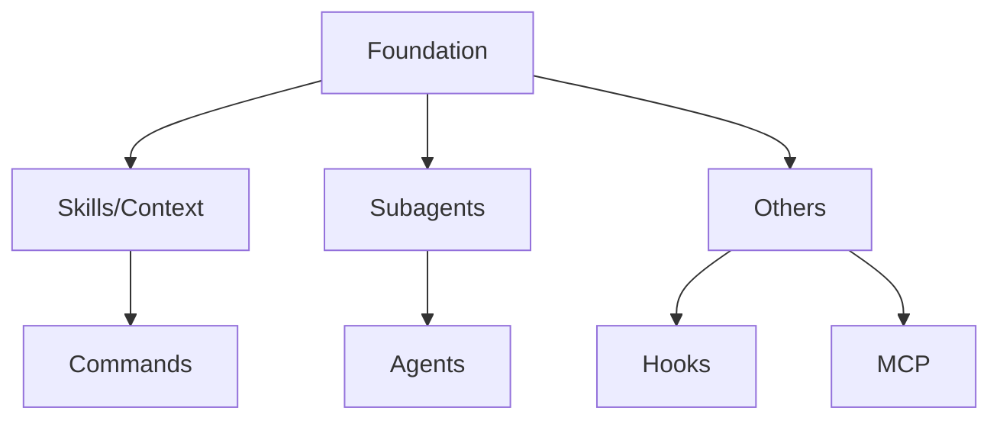

# 00-foundation.md

## Table of Contents

1. [Project Mission & Philosophy](#1-project-mission--philosophy)
   - [Project Mission](#project-mission)
   - [Philosophy: Autonomy-First (2026)](#philosophy-autonomy-first-2026)
   - [The Delta Principle](#the-delta-principle)
   - [Philosophy: Simplicity as Sophistication](#philosophy-simplicity-as-sophistication)
   - [Philosophy: AI Agents Are Smart and Lazy](#philosophy-ai-agents-are-smart-and-lazy)
   - [Success Criteria](#success-criteria)
   - [The Agentic Loop](#the-agentic-loop)
2. [Design Patterns](#2-design-patterns)
   - [Context Topology Primitives](#context-topology-primitives)
   - [Multi-Phase Delegation Pattern](#multi-phase-delegation-pattern)
   - [Manager Pattern](#manager-pattern)
   - [Loadout Agent Pattern](#loadout-agent-pattern)
   - [Context Compaction Defense](#context-compaction-defense)
   - [Skill Sandwich (Verification Loop)](#skill-sandwich-verification-loop)
   - [Decision Matrix](#decision-matrix)
   - [Anti-Patterns](#anti-patterns)
3. [Architecture Blueprint](#3-architecture-blueprint)
   - [Directory Layout](#directory-layout)
   - [Component Decision Matrix](#component-decision-matrix)
   - [Memory Discovery Behavior](#memory-discovery-behavior)
   - [Loading Priority](#loading-priority)
   - [CLAUDE.local.md](#claudelocalmd)
   - [Modular Rules](#modular-rules)
   - [Component Anatomy](#component-anatomy)
4. [Primitives Overview](#4-primitives-overview)
   - [Core Primitives Overview](#core-primitives-overview)
   - [Context Modes](#context-modes)
   - [Agent Types](#agent-types)
   - [Permission Modes](#permission-modes)
   - [Critical Rules](#critical-rules)
5. [Ecosystem Context](#5-ecosystem-context)
   - [The Agent Skills Standard](#the-agent-skills-standard)
   - [Implementation: Claude Code](#implementation-claude-code)
   - [Implementation: OpenCode](#implementation-opencode)
   - [Feature Matrix Summary](#feature-matrix-summary)
   - [Cross-Platform Portability](#cross-platform-portability)
   - [Compatibility Matrix](#compatibility-matrix)

---

## 1. Project Mission & Philosophy

### Project Mission

[OBVIOUS]

**Source:** foundation.md, lines 28-44

thecattoolkit_v3 is a meta-toolkit for building portable `.claude/` configuration components.

### Purpose

Create factory skills and commands for building AI agent components for Claude Code which are compatible across multiple platforms:
- Claude Code (primary)
- Cursor
- Zed
- GitHub Copilot

### Dual Role

1. **Health Maintenance**: Keep your agent configuration lean and effective
2. **Portable Component Factory**: Create skills, commands, agents, hooks, and MCP servers

---

### Philosophy: Autonomy-First (2026)

[FINDING]

**Source:** foundation.md, lines 613-702

#### The Paradigm Shift

| Old Way (2024) | New Way (2026) |
|----------------|----------------|
| Carefully constrain agents | Trust agents by default |
| List forbidden actions | State objectives and alternatives |
| Rigid step-by-step scripts | Autonomous decision-making |
| Magic syntax and formatting | Natural language |
| Micromanage every operation | Reactive constraints only |

**Key Insight**: Over-constraining agents causes more failures than under-constraining. Modern models (Claude 4+) follow instructions precisely—they don't need micromanagement.

#### Why This Matters

**The 2024→2026 paradigm shift reflects a fundamental change in how AI agents reason**. From an AI agent's perspective:

In 2024, models were less capable of following complex instructions. They needed rigid scripts because they would deviate, hallucinate, or ignore constraints. You had to micromanage—listing every forbidden action, specifying exact steps, using magic syntax to force compliance.

In 2026, models are instruction-following machines. They read what you write and execute it faithfully. But this creates a new problem: **over-constraint causes rigidity failure**. When you script every step, the agent cannot adapt when reality diverges from the script. It follows the plan off a cliff rather than adjusting course.

**Concrete example of 2024 failure**: You write "Step 1: Read file A. Step 2: Edit line 5." But file A was deleted in a previous operation. The 2024-style agent, following the rigid script, tries to read the deleted file, fails, and halts—or worse, creates a new file with the wrong content because the script said "edit line 5" and it needed to satisfy the constraint.

**Concrete example of 2026 success**: You write "Update the auth module to use the new API. Handle any missing files by checking git status first." The autonomous agent notices the file is gone, checks git status, sees it was deleted, and intelligently adjusts—perhaps recreating it from a backup or asking for clarification. The autonomy-first approach acknowledges that agents are smart enough to handle ambiguity, and constraints should be reactive (added after observing specific failure modes) rather than proactive (attempting to prevent every hypothetical problem).

---

### The Delta Principle

[FINDING]

**Source:** foundation.md, lines 639-671

**Good Component = Expert Knowledge − What Claude Already Knows**

#### What to Keep (Positive Delta)

| Category | Examples |
|:---------|:---------|
| **Best practices** | "Use `context: fork` for auditors" |
| **Modern conventions** | "Use gerund form for skill names" |
| **Project decisions** | "We use Manager Pattern for skill creation" |
| **Domain expertise** | "TypeScript 5.3+ supports `satisfies` operator" |
| **Anti-patterns** | "Don't use inline auditors, they're biased" |

#### What to Remove (Zero/Negative Delta)

| Category | Examples |
|:---------|:---------|
| **Basic programming** | How to write a for loop |
| **Standard library docs** | What `Array.map()` does |
| **Generic tutorials** | "What is a hook?" |
| **Claude-obvious** | "Use Read tool to read files" |

#### CLAUDE.md File Size Guidance

[OFFICIAL]

**Source:** Memory documentation

**VERIFIED ✓** (Source: https://code.claude.com/docs/en/memory)

**Keep CLAUDE.md concise** (under ~500 lines recommended). Bloated files cause Claude to ignore rules due to attention limits.

**If growing large, split into `.claude/rules/*.md` for modular loading.**

#### Why This Matters

**Removing obvious knowledge improves signal-to-noise ratio**—the most critical factor in agent performance. From an AI agent's perspective:

Agents have limited attention. Every token spent on "how to write a for loop" is a token not spent on "here's the specific error handling pattern we use." When you fill components with obvious information, you dilute the important information, making it harder for the agent to distinguish what matters.

This creates a pernicious failure mode: the agent sees a 2000-line skill file and treats all 2000 lines as equally important. It spends tokens thinking about basic concepts it already understands, then misses the one critical constraint buried at line 1800 because its attention was exhausted.

**Concrete example**: A skill that teaches "how to write React components" (obvious) followed by "we use styled-components with a specific theme object structure" (critical). The agent skims the file, sees mostly familiar React content, and misses the theme object requirement. It writes components using inline styles, violating your standards. Without the noise, the agent would have immediately seen: "Theme object structure (CRITICAL)" and applied it correctly. The Delta Principle ensures the agent's attention is spent only on what it doesn't already know.

---

### Philosophy: Simplicity as Sophistication

[FINDING]

**Source:** foundation.md, lines 416-559

**Principle:** The most sophisticated solution is often the simplest one. Complex command structures don't always indicate sophistication—sometimes they indicate over-engineering.

#### The Simplicity Paradox

Modern AI agents are capable of nuanced reasoning and dynamic adaptation. When you over-structure commands with rigid logic and predetermined paths, you:

1. **Constrain Intelligence:** Prevent natural adaptation to context
2. **Add Maintenance Burden:** Complex structures are harder to update
3. **Recreate Tool Features:** Build what AskUserQuestion already provides
4. **Reduce Flexibility:** Force users into predetermined paths

**Real Example: reviewer-v2.md**

The command at `.claude/commands/reviewer-v2.md` demonstrates this principle perfectly:

```
Over-Engineered Approach (imagine 200 lines):
IF user mentions web → ask framework questions
IF user mentions API → ask auth questions
IF user mentions database → ask schema questions
FOR each answer → branch to predetermined next question
Validate all fields filled → generate spec

Actual Simple Approach (22 lines in reviewer-v2.md):
"Follow user's instructions and use AskUserQuestionTool
to interview him in depth...

When you ask questions with AskUserQuestionTool:
- Always ask exactly one question at a time
- Offer meaningful answer choices plus 'Something else'
- Favor questions that uncover assumptions, constraints,
  edge cases, priorities, and tradeoffs

Continue one-question-at-a-time until you are confident
you have enough detail to write a thorough, internally
consistent specification."

Result: The 22-line natural language command outperforms
200-line scripted logic because it adapts dynamically
to whatever the user reveals.
```

#### When Simplicity Wins

**Simple natural language outperforms structure when:**

1. **Discovery is the Goal**
   - Requirements gathering
   - Architecture decisions
   - Problem clarification
   - Constraint identification

2. **User Needs Vary**
   - Different projects need different questions
   - Edge cases are unpredictable
   - Context changes during conversation

3. **Adaptation is Valuable**
   - Pivoting based on revelations
   - Following unexpected threads
   - Adjusting depth based on complexity

4. **Tools Handle Interaction**
   - AskUserQuestion for dialogue
   - Task for isolation
   - Read/Glob for context

#### The Simplicity Test

Before adding structure to a command or skill, ask:

1. **Does AskUserQuestion already handle this interaction pattern?**
2. **Am I forcing a predetermined path where adaptation would work better?**
3. **Could natural language guidelines achieve the same goal?**
4. **Is this complexity solving a real problem or imagined edge cases?**

**If the answer favors simplicity, start there. You can always add structure later.**

---

### Philosophy: AI Agents Are Smart and Lazy

[FINDING]

**Source:** foundation.md, lines 382-414

#### The Mental Model

```
AI Agent Behavior:
├── I READ SKILL.md (I DO read it)
├── I UNDERSTAND context (I'm smart)
├── I APPLY patterns (I'm capable)
└── I DON'T hunt for scattered references (I'm lazy/efficient)
```

#### The Rule: DEFAULT to SKILL.md

**Put EVERYTHING helpful in SKILL.md.**

| Where | When |
|:-----|:-----|
| SKILL.md | All core patterns, examples, guardrails |
| SKILL.md | Common edge cases (3-10 examples) |
| SKILL.md | Recognition questions |
| SKILL.md | Critical constraints |
| references/ | ONLY ultra-specific domain rules |
| references/ | ONLY massive data (>1000 lines) |
| references/ | ONLY user documentation |

#### The 500-Line "Limit" Is a Myth

**Losing knowledge is worse than a longer file.**

Centralized knowledge in SKILL.md is better than scattered fragments in references/.

---

### Success Criteria

[FINDING]

**Source:** foundation.md, lines 351-360

A component or project is successful when:

1. **Portability**: Works across Claude Code, Cursor, Zed, Copilot
2. **Automatic Quality**: Quality enforced by automation, not manual review
3. **Reusability**: Patterns are reusable, not one-off solutions
4. **Self-Documentation**: Components document themselves through structure
5. **Context Hygiene**: Main context stays clean, heavy work delegated

---

### The Agentic Loop

[OFFICIAL]

**Source:** foundation.md, lines 363-378

Claude Code operates through three phases that repeat until completion:

```
Gather Context → Take Action → Verify Results
         ↑______________|
```

| Phase | Description |
|-------|-------------|
| **Gather Context** | Read files, search codebase, understand structure |
| **Take Action** | Edit files, run commands, create resources |
| **Verify Results** | Check outputs, run tests, validate changes |

Claude chains these phases autonomously, adjusting based on new information.

---

## 2. Design Patterns

### Context Topology Primitives

**[FINDING]**

#### Choose Your Primitive Based on Context Hygiene

| Primitive | Memory Mode | Best For... | Context Behavior |
|:----------|:------------|:------------|:-----------------|
| **Skill (Default)** | **Shared** | Heuristics, code standards, "How-To" guides | Content injects, preserves history, sees parent context |
| **Skill (context: fork)** | **Isolated** | Specialists (Linter, Security Auditor) | Runs in isolated context, only CLAUDE.md + skill content |
| **Task (Subagent)** | **Forked** | Heavy lifting (Refactoring 20 files, running 100 tests) | Spawns new agent, keeps "noise" out of main context |
| **Command** | **Injected** | Entry points, workflows needing current state | Uses `@file` and ` !cmd ` for deterministic context |

#### Why This Matters

**Context hygiene directly determines token efficiency and agent output quality**. From an AI agent's perspective:

Every token in the context window is a resource—both financially (API costs) and cognitively (attention bandwidth). Agents operate best when they have **exactly the right amount of context**: enough to understand the task, but not so much that they waste attention on irrelevant information.

The context topology primitives give you surgical control over this:
- **Shared Skill**: Minimal overhead (~50 tokens), perfect for heuristics that need to see your current work
- **Forked Skill**: Isolation without spawn cost, perfect for validators who shouldn't see implementation baggage
- **Task Subagent**: Full isolation with fresh agent, perfect for heavy work that would pollute the main context
- **Command**: Deterministic injection, perfect for workflows needing precise initial state

**Concrete example of what goes wrong without hygiene**: You delegate a large refactoring to a Task subagent. The subagent works for 20 turns, trying different approaches, hitting dead ends, eventually succeeding. Without forking, all 20 turns of struggle remain in your main context. When you continue the conversation, every subsequent turn costs 2x more tokens (because the context is bloated), and the main agent is influenced by the subagent's earlier failed attempts. You end up with a slower, more expensive, lower-quality conversation because context wasn't properly managed.

---

### Multi-Phase Delegation Pattern

[FINDING]

**[FINDING]**

**⚠ CUSTOM** - The pattern is thecattoolkit_v3 terminology. Key constraint: **subagents cannot spawn subagents**.

#### Critical Constraint

**✓ VERIFIED** (Source: https://code.claude.com/docs/en/sub-agents)

- `Task → Task` nesting is **FORBIDDEN** (recursion blocker)
- `Skill(fork) → Skill(fork)` is **ALLOWED** (context isolation, not subagent spawn)

**⚠️ IMPORTANT**: The chain of forked skills (`Skill(fork) → Skill(fork) → Skill(fork)`) **does work reliably** and is a fundamental pattern for multi-phase validation. This is **context isolation**, not subagent spawning, which is why it bypasses the Task→Task recursion constraint. Each forked skill runs inline with isolated context but can pass information bidirectionally.

**Use this pattern when**: You need chained validation (create → validate → refine) without spawning true subagents. The forked context ensures each phase sees only what it needs, preventing bias from earlier attempts.

#### Pattern Structure

```
Level 1 (Main):     Conductor - Holds TodoWrite state
Level 2 (Task):     Subagent - Reads codebase, creates plan, executes
                    └── Can invoke inline skills (NOT forked)
Level 3 (Skill):    Verifier - Validates result
```

#### Why This Matters

**Multi-phase delegation enables bias prevention through complete isolation**. From an AI agent's perspective:

Bias is the silent killer of quality. When an agent sees how something was implemented—especially when it was implemented with struggle—it cannot help but be influenced. This is called "implementation bias" or "path dependency." The agent sees 5 failed attempts and thinks "the final solution must be a compromise" rather than "this is the correct solution."

The Multi-Phase Delegation pattern creates **true clean rooms**:
- The implementation subagent works in isolation, making mistakes, learning, iterating
- The verifier sees ONLY the final result—no history, no struggle, no bias
- The main conductor sees the unbiased verdict and can make objective decisions

**Concrete example of what goes wrong without isolation**: You write a complex algorithm. It takes you 5 attempts to get it right. You then ask an inline auditor (shared context) to review it. The auditor sees your struggle—"Attempt 1 failed with edge case X, Attempt 2 failed with edge case Y..."—and unconsciously lowers their standards. They think "well, given how hard this was, the current implementation is pretty good." They miss a critical bug because they're compensating for perceived difficulty. A forked verifier would have caught the bug immediately because they see only the code, not the struggle.

**⚠ CUSTOM** (Empirical finding): Skill(context: fork) runs inline with context isolation, allowing chained invocations with bidirectional information flow.

---

### Manager Pattern

**[FINDING]** Custom orchestration pattern

**⚠ CUSTOM** - The "Manager Pattern" is a thecattoolkit_v3 orchestration pattern. It leverages official features (`context: fork`, `agent: Explore`) but the pattern itself is custom.

**Official Patterns**: See [claude-skills-guide.md Chapter 5](../claude-skills-guide.md#chapter-5-patterns-and-troubleshooting) for official pattern documentation including sequential workflow, multi-MCP coordination, and iterative refinement patterns.

#### Pattern Structure

```
Main → Skill(manager) → TaskList tracking
       → Task(create component)
       → Skill(auditor, context: fork)
         → Returns: Pass/Fail + issues
       → If Fail: Retry Task(create)
       → If Pass: Return to Main
```

#### Why Quality-Standards is Forked

```yaml
# .claude/skills/quality-standards/SKILL.md
---
name: quality-standards
context: fork    # Auditor sees ONLY the draft
agent: Explore   # Read-only, cannot modify files
---
```

**Key Insight**: Auditor never sees implementation attempts, only the draft. This provides:
- Zero auditor bias
- Objective Pass/Fail
- Clear error list for fixes

#### Manager Pattern vs Inline Iteration

| Aspect | Manager Pattern | Inline Iteration |
|:-------|:----------------|:-----------------|
| **Auditor bias** | Zero (isolated) | Sees retries |
| **Complexity** | Higher | Lower |
| **Use when** | High-stakes, multiple gates | Simple self-correction |

#### Why This Matters

**The Manager Pattern implements quality gates with unbiased validation—essential for consistent high-quality output**. From an AI agent's perspective:

Agents have a psychological bias toward completion. Once they've invested effort into creating something, they want it to be "done." This leads to grade inflation—passing things that shouldn't pass, overlooking issues to maintain momentum.

The Manager Pattern solves this through **structural separation of creation and validation**:
- The creator (Task) is motivated to complete the work
- The validator (forked Skill) has no investment in the work—they didn't create it, they don't care about it
- The validator gives an objective Pass/Fail with specific issues
- The manager enforces the gate: Fail = must retry, Pass = can proceed

This creates **reliable quality assurance** that's not dependent on the creator's self-assessment.

**Concrete example of what goes wrong without the Manager Pattern**: You're creating a skill file. You write it, review it yourself, and think "this looks good." But you missed that the frontmatter is malformed (you were focused on the body content). Without a manager and forked auditor, you commit the broken skill. Later, when another agent tries to use it, the malformed frontmatter causes errors. With the Manager Pattern, the forked auditor—seeing only the file, not your intentions—immediately flags "frontmatter missing required field 'description'." The manager blocks the commit, you fix it, and the quality gate prevents the error from ever reaching production.

---

### Loadout Agent Pattern

[OFFICIAL]

**[FINDING]**

**✓ OFFICIAL** (Source: https://code.claude.com/docs/en/sub-agents) - The `skills:` field is an official feature. The "Loadout Agent Pattern" naming is thecattoolkit_v3 terminology.

#### Bundle Multiple Skills into a Reusable Agent

```yaml
# .claude/agents/builder.md
---
name: builder
description: "Specialized worker with skill-development, rule-expertise, and context-engineering capabilities."
skills:
  - skill-development
  - rule-expertise
  - context-engineering
---

You are a build specialist focused on creating .claude/ components.

## Your Capabilities
You have bundled access to:
- **skill-development**: Skill authoring patterns
- **rule-expertise**: Instruction writing
- **context-engineering**: Filesystem management

Use these capabilities directly.
```

#### Why `skills:` Field Matters

| Aspect | `skills:` (declarative) | `Skill()` call (imperative) |
|:--------|:------------------------|:---------------------------|
| **Discovery** | Claude knows upfront | Must recognize need |
| **Consistency** | Same skills every spawn | Ad-hoc decision |
| **Documentation** | Explicit manifest | Implicit, scattered |
| **Overhead** | ~100 tokens (metadata) | ~50 tokens (call) |

#### Why This Matters

**Skill bundling via the `skills:` field eliminates discovery overhead and ensures consistent capability availability**. From an AI agent's perspective:

When an agent spawns, it needs to know what it can do. Without the `skills:` field, the agent must discover capabilities dynamically—recognizing "I need skill X for this task" and then invoking it. This adds cognitive overhead and introduces variability.

The Loadout Agent pattern front-loads all capabilities via the `skills:` field:
- The agent knows immediately what skills it has access to
- No decision fatigue about which skills to invoke
- No risk of forgetting to invoke a critical skill
- Every spawn is identical—same capabilities, same behavior

This is especially important for **high-frequency operations**. If you're spawning a subagent 50 times in a workflow, those 50 discovery decisions add up to significant overhead and inconsistency.

**Concrete example of what goes wrong without bundling**: You have a skill that creates components. Sometimes it remembers to invoke the `quality-standards` skill to validate the output. Sometimes it forgets (it was focused on the creation logic). Sometimes it invokes the wrong skill. The output quality varies wildly based on what the agent happened to remember in the moment. With a Loadout Agent, the `quality-standards` skill is always available—the agent doesn't need to remember to invoke it, it's just there, part of the agent's identity. Every component gets validated, every time, consistently.

---

### Context Compaction Defense

**[FINDING]** Knowledge survival pattern

**✓ OFFICIAL** (Source: https://code.claude.com/docs/en/memory) - The use of `.claude/rules/*.md` is verified official. Pattern naming is custom.

#### Move ALL Procedural Knowledge to .claude/rules/

| Old Thinking | New Thinking |
|:-------------|:-------------|
| "How to write tests" in a Skill | Test rules in `.claude/rules/testing.md` |
| Specialist loses knowledge | Modular rules loaded into EVERY subagent by default |

#### Benefits

- Rules survive context compaction
- All subagents have same baseline knowledge
- Single source of truth for procedures

#### Why This Matters

**Context compaction defense ensures knowledge survival through `.claude/rules/*.md`—the only reliable way to persist information across long conversations**. From an AI agent's perspective:

Context compaction is inevitable in long conversations. When the context window fills, Claude compresses history, keeping summaries but dropping details. This is devastating for procedural knowledge—"how we write tests" becomes "we write tests," and the specifics (framework, patterns, coverage requirements) are lost.

`.claude/rules/*.md` files exist **outside the conversation window**. They are loaded fresh for every subagent, regardless of how long the conversation has been running. This means:
- Turn 1: Subagent loads rules, knows exactly how to write tests
- Turn 100: Subagent loads same rules, knows exactly how to write tests (even though the main context has been compacted 5 times)

**Concrete example of knowledge loss without defense**: You're working on a 3-hour refactoring session. Early on, you establish detailed conventions—"use vitest, mock external APIs with msw, ensure 90% coverage, follow the AAA pattern (Arrange-Act-Assert)." At hour 2, context compaction triggers. The detailed conventions are compressed to "we have testing standards." At hour 3, you spawn a subagent to write tests. The subagent sees "we have testing standards" but not what they are. It writes tests using jest (wrong framework), with no mocking (wrong pattern), at 40% coverage (wrong threshold), and no AAA structure. The tests are technically "tests" but violate every standard you carefully established. With `.claude/rules/testing.md`, the subagent loads the full, uncompressed standards every time—knowledge survives compaction.

---

### Skill Sandwich (Verification Loop)

**[FINDING]** Custom verification pattern

**⚠ CUSTOM** - The pattern concept is custom, but uses verified official features.

**Official Patterns**: See [claude-skills-guide.md Chapter 5](../claude-skills-guide.md#chapter-5-patterns-and-troubleshooting) for official iterative refinement and verification patterns.

```
Main → Skill(define_criteria) → Task(implement) → Skill(fork:linter) → Main
```

#### Pattern Flow

1. **Define**: First skill establishes success criteria
2. **Implement**: Task does the work
3. **Verify**: Forked linter has zero knowledge of implementation struggle

#### Why This Matters

**The Skill Sandwich creates a verification loop that catches errors before they compound**. From an AI agent's perspective:

Agents make mistakes. The longer they work without validation, the more those mistakes compound. A small error in step 1 becomes a foundational assumption for steps 2-10, making it exponentially harder to fix.

The Skill Sandwich pattern implements **continuous verification**:
1. **Define**: Establish success criteria before any work begins (the criteria skill)
2. **Implement**: Do the work (the Task subagent)
3. **Verify**: Validate against the original criteria (the forked linter skill)

This creates a **closed feedback loop** where the verifier references the original criteria, not the implementation. The verifier can't be gaslit by the implementation—"I did it this way because..."—because the verifier only sees the criteria and the result.

**Concrete example of error catching**: You're implementing a feature. The implementation subagent misunderstands a requirement and implements the wrong behavior. Without the Skill Sandwich, you might not discover this until days later when users report bugs. With the Skill Sandwich, the forked verifier compares the implementation against the original criteria (which explicitly stated the correct behavior) and immediately flags the discrepancy. The error is caught within minutes, not days, and hasn't had time to propagate into dependent code. The verification loop acts as a circuit breaker, stopping error propagation before it becomes catastrophic.

---

### Decision Matrix

**[FINDING]** Pattern selection guide

**Official Patterns**: See [claude-skills-guide.md Chapter 5](../claude-skills-guide.md#chapter-5-patterns-and-troubleshooting) for official workflow patterns.

| If the goal is... | Use this Pattern | Why? |
|:------------------|:-----------------|:-----|
| **Exploration** | `Skill(context: fork)` w/ `agent: Explore` | Fastest, cheapest, cannot accidentally break code |
| **High-Volume Edits** | `Task(subagent)` | Keeps context clean for high-level thoughts |
| **Strict Compliance** | `Skill(context: fork)` | No "Context Contamination" from previous shortcuts |
| **User Shortcuts** | `Command` | Allows `@` and `!` for deterministic context injection |
| **Safety Guardrails** | `Hooks` | Native enforcement that survives across subagents |
| **Quality-Driven Creation** | Manager Pattern | Unbiased validation with automatic retry |
| **Multi-Phase Workflow** | Chain of Experts | Clean separation, isolated phases |
| **Consistent Multi-Skill Worker** | Loadout Agent | Bundled capabilities, explicit manifest |
| **Task + Capabilities** | Composition Pattern | Workflow + capability bundle |
| **Dynamic Routing** | Dispatcher Pattern | Self-optimizing agentic loop |

---

### Anti-Patterns

[FINDING]

**[FINDING]**

**✓ VERIFIED** (Sources: https://code.claude.com/docs/en/sub-agents | https://code.claude.com/docs/en/memory)

| Anti-Pattern | Why Bad | Instead |
|:-------------|:--------|:--------|
| `Task → Task` nesting | Forbidden by recursion blocker | Use `Skill(fork) → Skill(fork)` (context isolation, not subagent) |
| Inline auditors | See retry history, biased | Use `Skill(auditor, context: fork)` |
| Monolithic CLAUDE.md | Hard to maintain, survive compaction | Use `.claude/rules/*.md` for modular rules |
| Scattered references | Agents won't hunt for info | Put core knowledge in SKILL.md |
| Proactive permission constraints | Adds unnecessary complexity | Use reactive constraints only after observing issues |

---

## 3. Architecture Blueprint

### Directory Layout

[OFFICIAL]

**[FINDING]**

**VERIFIED ✓** (Source: https://code.claude.com/docs/en/memory)

#### Standard .claude/ Structure

```
.claude/
├── CLAUDE.md              # Main instructions (always loaded)
├── CLAUDE.local.md        # Private overrides (auto gitignored)
├── rules/                 # Modular topic-specific rules
│   ├── code-style.md      # Language formatting
│   ├── testing.md         # Test conventions
│   ├── security.md        # Security patterns
│   └── frontend/          # Domain-specific
│       └── react.md
├── skills/                # Knowledge workers with folder structure
│   └── skill-name/
│       ├── SKILL.md       # Required: main instructions
│       ├── REFERENCE.md   # Optional: domain-specific details
│       └── scripts/       # Optional: utilities
├── commands/              # Single-file entry points
│   └── path/
│       └── to/
│           └── command.md  # Maps to /path:to:command
├── agents/                # Persistent personas with skill bundles
│   └── builder.md         # Agent with skills: field
├── scripts/               # Utility scripts for hooks
│   └── session-start.sh
└── settings.json          # Hooks configuration
```

#### Alternative: CLAUDE.md at Root

```
project-root/
├── CLAUDE.md              # Main instructions (always loaded)
├── CLAUDE.local.md        # Private overrides
└── .claude/
    ├── rules/
    ├── skills/
    ├── commands/
    ├── agents/
    └── settings.json
```

Both locations work. Choose one consistently.

#### settings.json Configuration

[OFFICIAL]

**Source:** Settings documentation

**VERIFIED ✓** (Sources: https://code.claude.com/docs/en/settings | https://code.claude.com/docs/en/iam)

The `settings.json` file controls permissions, hooks, and UI preferences.

**Permissions Section:**

```json
{
  "permissions": {
    "allow": [
      "Bash(npm run lint)",
      "Bash(npm test *)",
      "Bash(git status)",
      "Read(src/**)"
    ],
    "deny": [
      "Bash(curl *)",
      "Bash(wget *)",
      "Read(./.env)",
      "Read(./.env.*)",
      "Read(./secrets/**)"
    ]
  }
}
```

**Best Practices:**
- **Allow** safe, frequent operations to reduce approval fatigue
- **Deny** sensitive files to prevent accidental leakage
- Wildcard patterns: `*` matches any characters, `**` matches directories

#### settings.local.json

[OFFICIAL]

**Source:** Settings documentation

**VERIFIED ✓** (Source: https://code.claude.com/docs/en/settings)

Auto-gitignored local override file for machine-specific configuration:

**Use Cases:**
- Machine-specific paths
- Local telemetry preferences
- Environment-specific permission overrides
- Development vs production settings

**Example:**

```json
{
  "autoUpdatesChannel": "stable",
  "permissions": {
    "allow": [
      "Bash(/usr/local/bin/my-custom-script)"
    ]
  }
}
```

#### Status Line Configuration

[OFFICIAL]

**Source:** Status line documentation

**VERIFIED ✓** (Source: https://code.claude.com/docs/en/settings)

Configure a custom status line script via `settings.json`:

```json
{
  "statusLine": {
    "type": "command",
    "command": "bash .claude/scripts/statusline.sh"
  }
}
```

**Script Behavior:**
- Receives JSON via `stdin` with model usage, costs, current directory, git info
- Must output single line of text to `stdout`

---

### Component Decision Matrix

[FINDING]

**[FINDING]**

#### Choose the Right Component Type

| Need | Use | Why |
|:-----|:-----|:-----|
| **Persistent rules** | CLAUDE.md | Always loaded, project-wide |
| **User shortcuts** | Command | Single file, @/! injection |
| **Complex knowledge** | Skill | Folder structure, progressive disclosure |
| **Isolated work** | Subagent/Task | Forked context, independent execution |
| **Event automation** | Hook | Response to lifecycle events |
| **Tool extension** | MCP Server | Custom tools for all agents |
| **Reusable specialist** | Worker Skill | Encapsulated workflow, isolated |
| **Consistent multi-skill worker** | Loadout Agent | Bundled capabilities |

#### Component Comparison

| Aspect | Command | Skill | Agent | Hook | MCP Server |
|:-------|:--------|:------|:------|:-----|:------------|
| **File Structure** | Single `.md` | Folder with `SKILL.md` | Single `.md` | JSON/Script | Separate package |
| **Naming** | Folder path → `/path:to:name` | `name:` field | `name:` field | Event name | Server name |
| **User Invocation** | `/name` | `/name` | Spawned via `--agent` | Automatic | Tool calls |
| **Agent Invocation** | `Skill(name)` | `Skill(name)` | `Task(name, agent=...)` | Automatic | Tool calls |
| **Supporting Files** | No | Yes (`references/`, `scripts/`) | No | Yes (`scripts/`) | Yes |
| **@/! Injection** | Yes | Yes | No | N/A | N/A |
| **Precedence** | Lower | Higher (if same name, skill wins) | N/A | N/A | N/A |
| **Context** | Preserved | Preserved or Forked | Forked | N/A | N/A |
| **skills: Field** | No | No | Yes | No | No |

---

### Memory Discovery Behavior

[OFFICIAL]

**[FINDING]**

**VERIFIED ✓** (Source: https://code.claude.com/docs/en/memory)

#### Ancestor Discovery (Upward Walk)

From the current working directory (cwd), Claude Code walks UP the directory tree:

```
cwd = /project/src/feature/
↓ walk up
/project/src/feature/CLAUDE.md      (found, loaded)
/project/src/CLAUDE.local.md      (found, loaded)
/project/src/CLAUDE.md              (found, loaded)
/project/CLAUDE.local.md           (found, loaded)
~/.claude/CLAUDE.md                   (found, loaded)
/ (root) - stops here (not included)
```

**Key rules**:
- Recurses up to (but not including) the root directory `/`
- Loads **ALL** `CLAUDE.md` and `CLAUDE.local.md` files found
- Higher-level files load first as foundation
- No limit on number of ancestor files

#### Subtree Discovery (Lazy Loading)

CLAUDE.md files in subdirectories (descendants) are **NOT** loaded at launch:

```
cwd = /project/
# At startup: Loads /project/CLAUDE.md only
# NOT loaded: /project/src/CLAUDE.md

# When Claude reads files under /project/src/:
# Then: /project/src/CLAUDE.md is loaded
```

**Key rules**:
- Subtree CLAUDE.md files loaded **lazily** when Claude reads files in those directories
- Same behavior applies to `CLAUDE.local.md` in subtrees
- No eager loading of descendant memory files

#### Visual Example

```
project/
├── CLAUDE.md                    # ← Loaded at launch (from root)
├── CLAUDE.local.md              # ← Loaded at launch (can override)
├── .claude/
│   ├── CLAUDE.md                # ← Loaded at launch
│   └── rules/
│       └── database.md          # ← Loaded at launch
└── src/
    ├── api/
    │   └── CLAUDE.md            # ← NOT loaded at launch
    └── feature/
        └── CLAUDE.md            # ← NOT loaded at launch
        └── CLAUDE.local.md        # ← NOT loaded at launch

# Running from project/ root:
# Loaded: project/CLAUDE.md, project/CLAUDE.local.md, .claude/CLAUDE.md, .claude/rules/database.md
# Not loaded: src/api/CLAUDE.md, src/feature/CLAUDE.md (until working in those directories)

# When working on src/api/:
# Additionally loaded: src/api/CLAUDE.md (lazy loaded)
```

---

### Loading Priority

[OFFICIAL]

**Source:** foundation.md, lines 140-156

**✓ VERIFIED** (Source: https://code.claude.com/docs/en/memory)

When Claude Code starts, it loads memory files in this priority order:

| Priority | Location | Purpose | Example |
|:---------|:---------|:--------|:-------|
| **1** | **Managed Policy** | Organization-wide rules | `/Library/Application Support/ClaudeCode/CLAUDE.md` (macOS) |
| **2** | **User Memory** | Personal preferences | `~/.claude/CLAUDE.md` |
| **3** | **User Rules** | Personal modular rules | `~/.claude/rules/*.md` |
| **4** | **Project Memory** | Team-shared instructions | `./CLAUDE.md` or `./.claude/CLAUDE.md` |
| **5** | **Project Rules** | Modular topic-specific rules | `.claude/rules/*.md` |
| **6** | **Project Local** | Private project overrides | `./CLAUDE.local.md` (auto-gitignored) |

All files at the same priority level are loaded together. Higher priority files load first as a foundation for more specific ones.

---

### CLAUDE.local.md

[OFFICIAL]

**[FINDING]**

**Key Points:**

- Auto-added to `.gitignore` (never committed)
- Loaded after CLAUDE.md (can override/refine)
- Use for: Personal preferences, local sandbox URLs, environment-specific config, temporary experiments, API keys

---

### Modular Rules

[OFFICIAL]

**[FINDING]**

**Key Points:**

- All `.md` files discovered recursively and loaded automatically
- Path-specific rules via YAML frontmatter with `paths` field
- Symlinks supported for sharing rules
- User-level rules at `~/.claude/rules/`

---

### Component Anatomy

[OFFICIAL]

**[FINDING]**

#### Skill Structure

```
skills/my-skill/
├── SKILL.md              # Required: main instructions
├── REFERENCE.md          # Optional: domain-specific details
├── FORMS.md              # Optional: templates/forms
└── scripts/
    └── utility.py        # Executed, not loaded
```

#### Command Structure

```
commands/
└── meta/
    └── refine/
        └── commands.md   # Maps to /meta:refine:commands
```

**Naming**: Folder path maps to colon syntax.

#### Agent Structure

```yaml
# .claude/agents/builder.md
---
name: builder
description: "Specialized worker..."
skills:
  - skill-development
  - rule-expertise
  - context-engineering
---

You are a build specialist...
```

#### Hook Structure

```json
// .claude/settings.json
{
  "hooks": {
    "SessionStart": [
      {
        "matcher": "*",
        "hooks": [{
          "type": "command",
          "command": "./scripts/init.sh",
          "once": true
        }]
      }
    ]
  }
}
```

---

## 4. Primitives Overview

### Core Primitives Overview

[OFFICIAL]

**[FINDING]**

**✓ VERIFIED** (Sources: https://code.claude.com/docs/en/skills | https://code.claude.com/docs/en/sub-agents)

#### Task vs Skill Comparison

| Aspect | Task() | Skill() |
|:-------|:-------|:--------|
| **Context** | Isolated (new subagent) | Preserved (shared) |
| **System Prompt** | Subagent markdown body + preloaded skills | Skill content injects into current prompt |
| **Loads** | CLAUDE.md + rules/ + agent's skills: bundle (if Agent specified) | Inherits parent context |
| **Results** | Returns to parent as summary | Inline execution |
| **Use when** | Heavy lifting, high-volume edits, isolated work | Adding expertise, heuristics, reference content |

#### Key Distinction

**`Skill()` tool**: Injects content into CURRENT conversation, preserves history
- Agent continues with enhanced knowledge
- All conversation context remains available
- Can run inline or in forked context (`context: fork`)

**`Task()` tool**: Spawns NEW agent instance with isolated context
- Fresh start with only CLAUDE.md + rules/ + preloaded skills
- Parent conversation history NOT inherited
- Results cascade back as summary
- Cannot spawn other subagents (recursion blocker)

---

### Context Modes

[OFFICIAL]

**[FINDING]**

#### Shared Context (Skill Default)

**Characteristics**:
- Preserves conversation history
- Sees parent context
- Content injects into current agent
- Runs inline with main conversation

**Use for**:
- Heuristics and "how-to" guides
- Adding expertise to current work
- Context-dependent tasks
- Reference content and conventions

#### Forked Context (Task, Skill with context: fork)

**Characteristics**:
- Isolated context without shared history
- Only CLAUDE.md + rules/ loaded
- No parent conversation visible
- Runs in subagent (Task) or isolated skill context

**Use for**:
- Isolated work, unbiased validation
- Heavy lifting (keep main context clean)
- Specialists that shouldn't see history
- Skills with explicit tasks (not just guidelines)

<Warning>
`context: fork` only makes sense for skills with explicit instructions. If your skill contains guidelines like "use these API conventions" without a task, the subagent receives guidelines but no actionable prompt.
</Warning>

#### Injected Context (@/! Patterns)

**Characteristics**:
- Deterministic state injection
- Content resolved at invocation time (preprocessing)
- Replaces placeholders with actual values

**Use for**:
- Entry points with current state
- Workflows needing exact file content
- Commands that need git state
- Dynamic data from shell commands

**@ Pattern - File Injection**:
```markdown
---
@docs/architecture.md    // Inject file content
@src/utils/helpers.ts    // Multiple files supported
---
```

**! Pattern - Command Injection**:
```markdown
---
!`git rev-parse --abbrev-ref HEAD`  // Inject bash output
!`date -u +"%Y-%m-%dT%H:%M:%SZ"`     // Dynamic timestamps
---
```

---

### Agent Types

[OFFICIAL]

**[FINDING]**

**✓ VERIFIED** (Source: https://code.claude.com/docs/en/sub-agents)

#### Built-in Agents

| Agent | Model | Tools | Read-Only? | Use For |
|:-------|:------|:------|:-----------|:--------|
| **Explore** | Haiku (fast, low-latency) | Read-only (denied Write/Edit) | Yes | Fast codebase exploration, no modification risk |
| **Plan** | Inherits from main | Read-only (denied Write/Edit) | Yes | Research before planning, architecture decisions |
| **general-purpose** | Inherits from main | All tools | No | Complex multi-step tasks requiring exploration + action |
| **Bash** | Inherits from main | Bash only | No | Terminal operations, git commands |
| **statusline-setup** | Sonnet | All tools | No | Configure status line (`/statusline`) |
| **Claude Code Guide** | Haiku | Read-only | Yes | Answer questions about Claude Code features |

**Explore Thoroughness Levels**: When invoking Explore, Claude specifies thoroughness: **quick** (targeted lookups), **medium** (balanced exploration), or **very thorough** (comprehensive analysis).

#### When to Use Each Agent

**Explore**:
- Understanding codebase structure
- Finding files by patterns
- Research without modification risk
- Three thoroughness levels: quick, medium, very thorough

**Plan**:
- Creating implementation plans
- Researching before coding
- Architecture decisions
- Used automatically during plan mode

**general-purpose**:
- Implementing features
- Making code changes
- Running tests
- Complex multi-step operations

**Bash**:
- Git operations
- Build/test commands
- Terminal-only workflows
- Inherits model from main conversation

---

### Permission Modes

[OFFICIAL]

**[FINDING]**

**✓ VERIFIED** (Source: https://code.claude.com/docs/en/iam)

Claude Code supports several permission modes that control how the agent handles permission prompts:

| Mode | Behavior | Use Case |
|:-----|---------|:---------|
| **default** | Standard permission checking with prompts | Standard development workflow |
| **acceptEdits** | Auto-accept file edit permissions for the session | Trusted code editing |
| **dontAsk** | Auto-deny permission prompts (pre-approved tools still work) | Restricted environment |
| **bypassPermissions** | Skip all permission checks ⚠️ | Safe environments only, CI/CD |
| **plan** | Plan Mode - read-only exploration, no modifications | Safe analysis, planning phase |

<Warning>
Use `bypassPermissions` with caution. It skips all permission checks, allowing the subagent to execute any operation without approval.
</Warning>

Permission rules are evaluated in order: **deny → ask → allow**. The first matching rule wins, so deny rules always take precedence.

#### Tool-Specific Permission Rules

**Bash with wildcards**:
- `Bash(npm run build)` - exact match
- `Bash(npm run test *)` - commands starting with prefix
- `Bash(* install)` - commands ending with suffix
- `Bash(git * main)` - pattern matching anywhere

**Subagent control**:
- `Task(Explore)` - allows Explore subagent
- `Task(Plan)` - allows Plan subagent
- Add to `deny` array to disable specific agents

---

### Critical Rules

[OFFICIAL]

**[FINDING]**

**✓ VERIFIED** (Source: https://code.claude.com/docs/en/sub-agents)

#### What's Allowed and Forbidden

```
Main → Task(subagent)      → Isolated context, true subagent spawn
Main → Skill(skill)        → Inline, shares context
Task → Skill(skill)        → Allowed, subagent invokes inline skill
Skill(fork) → Skill(fork)  → ALLOWED (isolated context, not subagent spawn)
Skill(fork) → Task(agent)  → FORBIDDEN (still blocks recursion)

Task → Task(subagent)      → FORBIDDEN (recursion blocker)
```

#### The Subagent Constraint

**Task → Task nesting is FORBIDDEN** to prevent infinite recursion. This is a hard constraint in Claude Code.

**⚠ CUSTOM** (Empirical finding): `Skill(context: fork)` with `agent:` field spawns a subagent with the skill content as task. The skill determines the task, the agent determines the execution environment (model, tools, permissions).

#### Skills vs Subagents: Two Directions

| Approach | System Prompt | Task | Also Loads |
|:---------|:--------------|:-----|:-----------|
| Skill with `context: fork` | From agent type (Explore, Plan, etc.) | SKILL.md content | CLAUDE.md + rules/ |
| Task invoking Agent (with skills: field) | Agent's markdown body | Claude's delegation message | Agent's skills: bundle + CLAUDE.md |

---

## 5. Ecosystem Context

### The Agent Skills Standard

[OFFICIAL]

**[FINDING]**

**✓ VERIFIED** (Source: https://agentskills.io/specification)

The Agent Skills format is an open standard originally developed by Anthropic, released for cross-platform portability.

#### Directory Structure

```
skill-name/
├── SKILL.md          # Required: main instructions + YAML frontmatter
├── scripts/          # Optional: executable code
├── references/       # Optional: additional documentation
└── assets/           # Optional: templates, resources, images
```

#### Standard Frontmatter Fields

| Field | Required | Constraints |
|:------|:---------|:------------|
| `name` | Yes | 1-64 chars, lowercase a-z and hyphens only |
| `description` | Yes | 1-1024 chars |
| `license` | No | License name or file reference |
| `compatibility` | No | Max 500 chars |
| `metadata` | No | Key-value map |
| `allowed-tools` | No | Space-delimited list (experimental) |

---

### Implementation: Claude Code

[OFFICIAL]

**[FINDING]**

**✓ VERIFIED** (Source: https://code.claude.com/docs/en/skills)

Claude Code fully implements the Agent Skills standard with significant extensions.

#### Claude Code Extensions

| Extension | Purpose | Standard? |
|:----------|:--------|:----------|
| `context: fork` | Run in isolated subagent context | ❌ Extension |
| `agent: Explore/Plan/general-purpose` | Specify agent type | ❌ Extension |
| `skills:` | Pre-load skills at agent spawn | ❌ Extension |
| `user-invocable` | Control visibility in `/` menu | ❌ Extension |
| `disable-model-invocation` | Require explicit user intent | ❌ Extension |
| `argument-hint` | Show expected arguments | ❌ Extension |
| `model` | Override model | ❌ Extension |
| `hooks` | Event-driven automation | ❌ Extension |

#### The `skills:` Field (Claude Code Exclusive)

```yaml
---
name: builder
skills:
  - skill-development
  - rule-expertise
  - quality-standards
---
```

**What it does:**
- Pre-loads skill content at agent spawn
- All bundled skills available immediately
- No need to invoke as separate skills

---

### Implementation: OpenCode

[OFFICIAL]

**[FINDING]**

**✓ VERIFIED** (Source: https://opencode.ai/docs)

#### OpenCode Differences

| Feature | OpenCode | Claude Code |
|:--------|:---------|:------------|
| **Skill Loading** | On-demand via `skill()` tool | Automatic activation |
| **Agent Types** | `mode: primary/subagent` | `context: fork` + `agent:` |
| **Agent Switching** | Tab key cycles primary agents | `/agents` command interface |
| **Skill Invocation** | `@skill-name` or `skill()` | Automatic or `/skill-name` |
| **Skills Field** | ❌ Not supported | ✅ `skills:` pre-loading |
| **Hooks** | ❌ Not mentioned | ✅ Full hooks system |

#### On-Demand Skill Loading

Unlike Claude Code's automatic activation, OpenCode requires explicit skill invocation:

```
# User types:
@pdf-processing help me extract text

# Or agent calls:
skill("pdf-processing", { file: "doc.pdf" })
```

---

### Feature Matrix Summary

[OFFICIAL]

**[FINDING]**

#### Skills Comparison

| Feature | Standard | Claude Code | OpenCode |
|:--------|:---------|:------------|:---------|
| `SKILL.md` + YAML | ✅ | ✅ | ✅ |
| `name`, `description` | ✅ | ✅ | ✅ |
| `context: fork` | ❌ | ✅ | ❌ |
| `agent:` field | ❌ | ✅ | ❌ |
| `skills:` field | ❌ | ✅ | ❌ |
| Hooks | ❌ | ✅ | ❌ |
| Auto-activation | Optional | ✅ | ❌ |

#### Commands Comparison

| Feature | Claude Code | OpenCode |
|:--------|:------------|:---------|
| **Relationship** | Unified with skills | Separate concept |
| **Invocation** | `/path:to:command` | `/command-name` |
| **Subtask** | Implicit | `subtask: true` |

---

### Cross-Platform Portability

[OFFICIAL]

**[FINDING]**

#### Design for Maximum Compatibility

**✅ Portable (Works Everywhere):**
- Use standard frontmatter: `name`, `description`
- Include `license` and `compatibility`
- Organize with `scripts/`, `references/`, `assets/`
- Keep `SKILL.md` under 500 lines
- Use progressive disclosure

**⚠️ Claude Code Only:**
- `context: fork` + `agent:`
- `skills:` field
- Hooks

**❌ Not Portable:**
- OpenCode `mode: primary/subagent`
- OpenCode `skill()` tool syntax
- Temperature and step limits

#### Summary

| Platform | Strength | Best For |
|:---------|:---------|:---------|
| **Standard** | Portability | Cross-platform sharing |
| **Claude Code** | Advanced features | Complex workflows |
| **OpenCode** | Explicit control | Manual workflows |

Design for the standard, enhance with platform-specific features when needed.

---

### Compatibility Matrix

[FINDING]

**Source:** foundation.md, lines 562-574

This project follows the [Agent Skills Standard](https://agentskills.io) (December 2025).

#### Compatibility Matrix

| Platform | Skills | Commands | Agents | Hooks |
|----------|--------|----------|--------|-------|
| Claude Code | ✅ | ✅ | ✅ | ✅ |
| Cursor | ✅ | ✅ | Partial | Partial |
| Zed | ✅ | ✅ | Roadmap | Roadmap |
| Copilot | ✅ | ✅ | Roadmap | Roadmap |

---
