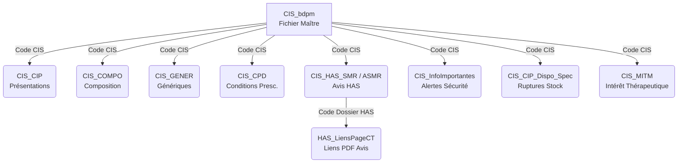

# Structure Technique des Fichiers BDPM

Ce document constitue la référence technique absolue pour le développement de parsers destinés à la Base de Données Publique des Médicaments (BDPM). Il synthétise les spécifications officielles de l'ANSM, l'analyse structurelle des fichiers bruts et les contraintes observées sur les données réelles.

## ⚠️ Contraintes Critiques de Parsing

Tout développeur doit impérativement respecter les règles suivantes sous peine de corruption de données :

1.  **Encodage Caractères** : `Windows-1252` (CP1252) - généré au niveau du téléchargement des fichiers txt.
2.  **Format de Fichier** : TSV (Tab Separated Values).
    *   **Séparateur** : Tabulation (`\t`) uniquement.
    *   **Pas de Qualificateurs** : Il n'y a **jamais** de guillemets autour des chaînes de caractères, même si elles contiennent des espaces ou des points-virgules.
3.  **Séparateurs Multi-valeurs** :
    *   Au sein d'une colonne isolée, le point-virgule `;` sépare les valeurs multiples (ex: `orale;rectale`).
    *   **Danger** : Des points-virgules existent aussi dans le texte libre (ex: "Arrêté du ; ..."). **Règle d'or** : Toujours découper la ligne par tabulation `\t` avant de traiter les sous-valeurs.
4.  **Hétérogénéité des Dates** :
    *   Standard BDPM : `DD/MM/YYYY` (ex: `25/12/2023`).
    *   Standard HAS (SMR/ASMR) : `YYYYMMDD` (ex: `20231225`).
    *   Standard InfoImportantes : `YYYY-MM-DD` (ISO-8601, ex: `2023-12-25`).

---

## 🔗 Modèle Relationnel



---

## **1. 📁 CIS_bdpm.txt (Fichier Maître)**

**Rôle** : Définit l'identité unique du médicament et ses propriétés réglementaires.
**Clé Primaire** : Code CIS (Colonne 1).

### 🛠️ Règles de Parsing Spécifiques
*   **Titulaire (Col 11)** : Nécessite un nettoyage (`Trim`) car souvent préfixé d'espaces. Peut contenir plusieurs laboratoires séparés par `;`.
*   **Voies d'administration (Col 4)** : Liste séparée par `;`.

| # | Champ | Type | Format / Exemple | Notes Techniques |
| :--- | :--- | :--- | :--- | :--- |
| **1** | **Code CIS** | Int | `62904108` | Identifiant unique (8 chiffres). |
| **2** | Dénomination | String | `DIPROSONE 0,05 %, pommade` | Nom commercial complet. |
| **3** | Forme Pharma | String | `pommade` | Forme galénique. |
| **4** | Voies Admin | String | `cutanée` ou `orale;rectale` | **Multi-valeurs** (séparateur `;`). |
| **5** | Statut AMM | String | `Autorisation active` | Valeurs: `Active`, `Abrogée`, `Archivée`, etc. |
| **6** | Type Procédure | String | `Procédure nationale` | Type d'autorisation. |
| **7** | État Commercial | String | `Commercialisée` | `Commercialisée` ou `Non commercialisée`. |
| **8** | Date AMM | Date | `11/01/1999` | Format **DD/MM/YYYY**. |
| **9** | Statut BDM | String | `Warning disponibilité` | `Alerte` (Rouge), `Warning disponibilité` (Gris), ou Vide. |
| **10** | Numéro EU | String | `EU/1/00/142` | Numéro d'autorisation européenne (peut être vide). |
| **11** | Titulaire | String | `SANOFI` | **Multi-valeurs**. Nettoyer les espaces. |
| **12** | Surveillance | Bool | `Non` | `Oui` (Triangle noir ⚠️) ou `Non`. |

**Exemples de données brutes (aléatoire) :**
```tsv
64896432    BECLOMETASONE/FORMOTEROL VIATRIS 100/6 microgrammes/dose, solution pour inhalation en flacon pressurisé solution pour inhalation    inhalée Autorisation active Procédure décentralisée Commercialisée  17/11/2022           VIATRIS SANTE  Non
62543825    DERMO-6 1,2 g/100 g, solution pour application cutanée  solution pour application   cutanée Autorisation active Procédure nationale Commercialisée  28/05/1996           PHARMA DEVELOPPEMENT   Non
60663441    IMATINIB SANDOZ 400 mg, comprimé pelliculé sécable  comprimé pelliculé sécable  orale   Autorisation active Procédure décentralisée Commercialisée  02/09/2016           SANDOZ Non
67203730    OPTIMIZETTE 75 microgrammes, comprimé pelliculé comprimé pelliculé  orale   Autorisation active Procédure décentralisée Commercialisée  26/03/2014           LABORATOIRES MAJORELLE Non
62140055    NEBIVOLOL/HYDROCHLOROTHIAZIDE TEVA 5 mg/12,5 mg, comprimé pelliculé comprimé pelliculé  orale   Autorisation active Procédure décentralisée Commercialisée  20/08/2018           TEVA SANTE Non
64456251    NALOXONE VIATRIS 0,4 mg/1 ml, solution injectable en ampoule    solution injectable intraveineuse   Autorisation active Procédure nationale Commercialisée  31/12/1993           VIATRIS SANTE  Non
61956319    LEVETIRACETAM ARROW LAB 500 mg, comprimé pelliculé sécable  comprimé pelliculé sécable  orale   Autorisation active Procédure décentralisée Commercialisée  20/10/2014           ARROW GENERIQUES   Non
61938189    SPIRONOLACTONE ARROW 50 mg, comprimé pelliculé sécable  comprimé pelliculé sécable  orale   Autorisation active Procédure nationale Commercialisée  09/10/1995           ARROW GENERIQUES   Non
69388669    SEROPRAM 20 mg, comprimé pelliculé sécable  comprimé pelliculé sécable  orale   Autorisation active Procédure nationale Commercialisée  26/12/1994           LUNDBECK SAS   Non
61693569    NOVOMIX 30 FLEXPEN 100 Unités/ml, suspension injectable en stylo prérempli  suspension injectable   sous-cutanée    Autorisation active Procédure centralisée   Commercialisée  29/01/2001      EU/1/00/142  NOVO NORDISK (DANEMARK)    Non
63036376    CYCLO 3 FORT, gélule    gélule  orale   Autorisation active Procédure nationale Commercialisée  10/10/1986           PIERRE FABRE MEDICAMENT    Non
62118322    VALSARTAN KRKA 80 mg, comprimé pelliculé sécable    comprimé pelliculé sécable  orale   Autorisation active Procédure de reconnaissance mutuelle    Commercialisée  23/02/2010           KRKA (SLOVENIE)    Non
68646885    CEFTRIAXONE VIATRIS 250 mg, poudre pour solution injectable poudre pour solution injectable intramusculaire;intraveineuse   Autorisation active Procédure nationale Commercialisée  07/09/2000           VIATRIS SANTE  Non
68332774    GLUCONATE DE CALCIUM PROAMP 10 %, solution injectable   solution injectable intraveineuse   Autorisation active Procédure nationale Commercialisée  29/03/2007           AGUETTANT  Non
64602464    CLEMATIS ERECTA BOIRON, degré de dilution compris entre 2CH et 30CH ou entre 4DH et 60DH     comprimé et solution(s) et granules et poudre et pommade   cutanée;orale;sublinguale   Autorisation active Enreg homéo (Proc. Nat.)    Commercialisée  08/04/2011           BOIRON Non
63226984    SOLUPRED 20 mg, comprimé orodispersible comprimé orodispersible orale   Autorisation active Procédure nationale Commercialisée  16/04/1999           CHEPLAPHARM ARZNEIMITTEL (ALLEMAGNE)   Non
61339773    YESINTEK 45 mg, solution injectable en seringue préremplie  solution injectable sous-cutanée    Autorisation active Procédure centralisée   Commercialisée  14/02/2025      EU/1/24/1892     BIOSIMILAR COLLABORATIONS IRELAND (IRLANDE)    Oui
67423363    ARIPIPRAZOLE ALMUS 15 mg, comprimé  comprimé    orale   Autorisation active Procédure de reconnaissance mutuelle    Commercialisée  26/07/2021           ALMUS FRANCE   Non
60647444    LIDOCAINE/PRILOCAINE AGUETTANT 5 %, pansement adhésif cutané    pansement adhésif(ve)   cutanée Autorisation active Procédure nationale Commercialisée  29/10/2013           AGUETTANT  Non
64397504    COMIRNATY JN.1 10 microgrammes/dose, dispersion injectable. Vaccin à ARMm contre la COVID-19    dispersion injectable   intramusculaire Autorisation active Procédure centralisée   Commercialisée  03/07/2024      EU/1/20/1528     BIONTECH MANUFACTURING (ALLEMAGNE) Oui
62955775    VELPHORO 500 mg, comprimé à croquer comprimé à croquer  orale   Autorisation active Procédure centralisée   Commercialisée  26/08/2014      EU/1/14/943  VIFOR FRESENIUS MEDICAL CARE RENAL PHARMA FRANCE   Non
63553427    SEROTONINUM BOIRON, degré de dilution compris entre 3CH et 30CH ou entre 6DH et 60DH    granules    orale;sublinguale   Autorisation active Enreg homéo (Proc. Nat.)    Commercialisée  27/11/2020           BOIRON Non
63374716    BORAX / ACIDE BORIQUE ARROW 12 mg/18 mg/ml, solution pour lavage ophtalmique en récipient unidose   solution pour lavage    ophtalmique Autorisation active Procédure nationale Commercialisée  20/01/2022           ARROW GENERIQUES   Non
60580134    CEFOXITINE SUBSTIPHARM 2 g, poudre pour solution injectable poudre pour solution injectable intraveineuse   Autorisation active Procédure nationale Commercialisée  21/09/2010           SUBSTIPHARM    Non
64927582    TEUCRIUM SCORODONIA BOIRON, degré de dilution compris entre 3CH et 30CH ou entre 6DH et 60DH     comprimé et solution(s) et granules et poudre et pommade   cutanée;orale;sublinguale   Autorisation active Enreg homéo (Proc. Nat.)    Commercialisée  04/11/2015           BOIRON Non
64022454    VANCOMYCINE SANDOZ 500 mg, poudre pour solution à diluer pour perfusion ou pour solution buvable    poudre pour solution à diluer pour perfusion ou buvable intrapéritonéale;intraveineuse  Autorisation active Procédure nationale Commercialisée  23/12/1988           SANDOZ Non
63926641    ATORVASTATINE EG LABO 10 mg, comprimé pelliculé comprimé pelliculé  orale   Autorisation active Procédure décentralisée Commercialisée  03/01/2017           EG LABO - LABORATOIRES EUROGENERICS    Non
66676431    MENTHA ARVENSIS BOIRON, degré de dilution compris entre 2CH et 30CH ou entre 4DH et 60DH     comprimé et solution(s) et granules et poudre et pommade   cutanée;orale;sublinguale   Autorisation active Enreg homéo (Proc. Nat.)    Commercialisée  25/01/2021           BOIRON Non
61409314    MVASI 25 mg/mL, solution à diluer pour perfusion    solution à diluer pour perfusion    intraveineuse   Autorisation active Procédure centralisée   Commercialisée  15/01/2018      EU/1/17/1246     AMGEN TECHNOLOGY (IRELAND) Non
65069229    ZOVIRAX 5 %, crème  crème   cutanée Autorisation active Procédure nationale Commercialisée  08/01/1986           GLAXOSMITHKLINE    Non
```

---

## **2. 📁 CIS_CIP_bdpm.txt (Présentations & Prix)**

**Rôle** : Contient les conditionnements (boîtes), les codes barres (CIP), les prix et les taux de remboursement.
**Liaison** : Via Code CIS.

### 🛠️ Règles de Parsing Spécifiques
*   **Prix (Col 10, 11, 12)** : Format français (`1.234,56`).
    *   *Algorithme* : Retirer toutes les virgules sauf la dernière. Remplacer la dernière virgule par un point. Parser en Float.
    *   *Cas Vide* : Si le champ est vide (juste des tabulations), la valeur est `0.0`.
*   **Taux (Col 9)** : Peut contenir plusieurs valeurs (`30%;65%`). Attention aux espaces (`65 %`).
*   **Texte (Col 13)** : Contient du HTML (`<br>`) et des points-virgules.

| # | Champ | Type | Format / Exemple | Notes Techniques |
| :--- | :--- | :--- | :--- | :--- |
| **1** | Code CIS | Int | `62904108` | Clé étrangère. |
| **2** | CIP7 | Int | `3003994` | Ancien code (7 chiffres). |
| **3** | Libellé | String | `plaquette(s) de 30...` | Description du conditionnement. |
| **4** | Statut Admin | String | `Présentation active` | |
| **5** | État Commercial | String | `Déclaration de commercialisation` | |
| **6** | Date Déclar. | Date | `03/10/2016` | Format **DD/MM/YYYY**. |
| **7** | **CIP13** | Int | `3400930039946` | **Identifiant Unique Boîte** (Datamatrix). |
| **8** | Agrément Coll. | Enum | `oui` | `oui`, `non`, `inconnu`. |
| **9** | Taux Remb | String | `65%` | **Multi-valeurs**. Format variable (avec ou sans espace). |
| **10** | Prix TTC | Float | `25,14` | Prix sans honoraires. Peut être vide. |
| **11** | Prix Global | Float | `26,16` | Prix payé par le patient (TTC + Honoraires). |
| **12** | Honoraire | Float | `1,02` | Montant honoraire dispensateur. |
| **13** | Indications | HTML | `Ce médicament...<br>` | Conditions de remboursement. Peut être vide. |

**Exemples de données brutes (aléatoire) :**
```tsv
62904108    3003994 1 inhalateur(s) multidose(s) acrylonitrile butadiène styrène de 120 dose(s). Chaque inhalateur est conditionné dans un sachet   Présentation active Déclaration de commercialisation    03/10/2016  3400930039946   oui 65% 25,14   26,16   1,02    
67513654    3004418 plaquette(s) PVC PVDC aluminium de 30 capsule(s)    Présentation active Déclaration de commercialisation    26/03/2018  3400930044186   oui 30% 8,82    9,84    1,02    
65556347    3791605 plaquette(s) thermoformée(s) PVC PVDC aluminium de 30 gélule(s) Présentation active Déclaration d'arrêt de commercialisation    05/03/2024  3400937916059   non 65% 3,14    4,16    1,02    
64518219    3016391 plaquette(s) OPA : polyamide orienté aluminium PVC-Aluminium de 90 comprimé(s)  Présentation active Déclaration de commercialisation    24/09/2019  3400930163917   oui 65 %    48,97   51,73   2,76    
66157358    3006125 plaquette(s) polyamide aluminium polyéthylène haute densité (PEHD) polyéthylène  avec déshydratant de 60 comprimé(s)    Présentation active Déclaration de commercialisation    02/01/2019  3400930061251   oui                 
60337328    3749253 plaquette(s) PVC polyéthylène PVDC aluminium de 90 comprimé(s)  Présentation active Déclaration de commercialisation    02/07/2012  3400937492539   oui 65% 13,76   16,52   2,76    
64728922    3441940 1 flacon(s) en verre brun avec fermeture de sécurité enfant de 15,9 g de granulés - 1 flacon(s) polyéthylène haute densité (PEHD) avec fermeture de sécurité enfant de 86 ml de solvant avec cuillère-mesure polyéthylène   Présentation active Déclaration de commercialisation    11/01/1999  3400934419409   oui 65% 36,41   37,43   1,02    
60817925    3000322 flacon(s) polyéthylène haute densité (PEHD) de 100 comprimé(s)  Présentation active Déclaration d'arrêt de commercialisation    31/03/2025  3400930003220   non 65% 43,46   44,48   1,02    
64552794    3008245 plaquette(s) PVC polyéthylène PVDC aluminium de 90 comprimé(s)  Présentation active Déclaration de commercialisation    02/01/2019  3400930082454   oui 65% 26,86   27,88   1,02    
64500961    3016422 plaquette(s) PVC-Aluminium de 25 comprimé(s)    Présentation active Déclaration de commercialisation    25/02/2021  3400930164228   oui 65% 8,94    9,96    1,02    
61754805    4150908 2 film(s) thermosoudé(s) papier polyéthylène aluminium P-A-M-éthylène (SURLYN) de 4 comprimé(s) Présentation active Déclaration de commercialisation    12/05/2014  3400941509087   oui 65% 1,16    2,18    1,02    
62931952    3920474 plaquette(s) PVC-Aluminium de 90 comprimé(s)    Présentation active Déclaration de commercialisation    01/03/2011  3400939204741   oui 65% 26,86   27,88   1,02    
63595052    3007781 1 flacon(s) en verre brun de 100 ml avec gobelet(s) doseur(s) polypropylène Présentation active Déclaration de commercialisation    08/12/2017  3400930077818   non 
```

---

## **3. 📁 CIS_COMPO_bdpm.txt (Composition)**

**Rôle** : Définit la composition qualitative et quantitative.
**Relation** : Un CIS possède plusieurs lignes (une par substance).

### 🛠️ Règles de Parsing Spécifiques
*   **Nature (Col 7)** : Bien que la spec officielle mentionne `ST`, on trouve historiquement `FT`. Il faut mapper `FT` et `ST` comme "Fraction Thérapeutique".

| # | Champ | Type | Exemple | Notes Techniques |
| :--- | :--- | :--- | :--- | :--- |
| **1** | Code CIS | Int | `60064527` | Clé étrangère. |
| **2** | Élément | String | `comprimé` | Forme pharmaceutique de l'élément. |
| **3** | Code Substance | Int | `03860` | ID unique substance (référentiel interne ANSM). |
| **4** | Dénomination | String | `HESPÉRIDINE` | Nom de la substance. |
| **5** | Dosage | String | `50 mg` | Texte libre. |
| **6** | Réf Dosage | String | `un comprimé` | Unité de référence du dosage. |
| **7** | Nature | Enum | `FT` | `SA` (Subst. Active), `FT` ou `ST` (Fraction Thérapeutique). |
| **8** | Lien | Int | `1` | ID technique de liaison SA/FT. |

**Exemples de données brutes (dans l'ordre de la première colonne):**
```tsv
60064527    comprimé    00769   DIOSMINE    450 mg  un comprimé FT  1
60064527    comprimé    03860   HESPÉRIDINE 50 mg   un comprimé FT  1
60064527    comprimé    33609   FRACTION FLAVONOÏQUE PURIFIÉE MICRONISÉE    500 mg  un comprimé SA  1
60064872    gélule  28886   BROMHYDRATE DE GALANTAMINE          SA  1
60064872    gélule  32833   GALANTAMINE 8 mg    une gélule  FT  1
60065198    comprimé    07958   CHLORHYDRATE DE CÉLIPROLOL  200 mg  un comprimé SA  1
60065294    comprimé    38524   PANTOPRAZOLE    20 mg   un comprimé FT  1
60065294    comprimé    67373   PANTOPRAZOLE SODIQUE SESQUIHYDRATÉ  22,56 mg    un comprimé SA  1
60065390    comprimé    39396   FUMARATE DE FÉSOTÉRODINE    8 mg    un comprimé SA  1
60065390    comprimé    93951   FÉSOTÉRODINE    6,2 mg  un comprimé FT  1
60067562    solution    00952   KETOTIFÈNE (FUMARATE DE)    0,0276 g    100 ml  SA  2
60067562    solution    15401   KETOTIFÈNE BASE 0,02 g  100 ml  FT  2
60068002    comprimé    78924   OXALATE D'ESCITALOPRAM          SA  1
60068002    comprimé    89971   ESCITALOPRAM    10 mg   un comprimé FT  1
60068034    gélule  46403   MILNACIPRAN 21,77 mg    une gélule  FT  1
60068034    gélule  75210   CHLORHYDRATE DE MILNACIPRAN 25 mg   une gélule  SA  1
60068251    comprimé    39727   AMLODIPINE  10 mg   un comprimé FT  2
60068251    comprimé    52431   PÉRINDOPRIL 6,79 mg un comprimé FT  1
60068251    comprimé    69916   PÉRINDOPRIL ARGININE    10 mg   un comprimé SA  1
60068251    comprimé    93748   BÉSILATE D'AMLODIPINE   13,87 mg    un comprimé SA

//

60097833    gel 00614   CLOBÉTASOL (PROPIONATE DE)  0,05 g  100 g   SA  1
60099738    comprimé    05248   AMOXICILLINE ANHYDRE    500 mg  un comprimé FT  1
60099738    comprimé    28165   AMOXICILLINE TRIHYDRATÉE            SA  1
60099738    comprimé    29442   CLAVULANATE DE POTASSIUM            SA  2
60099738    comprimé    93286   CLAVULANIQUE (ACIDE)    62,5 mg un comprimé FT  2
60100877    collyre 22466   BÉTAXOLOL (CHLORHYDRATE DE) 0,56 g  100 ml  SA  2
60100877    collyre 36349   BÉTAXOLOL BASE  0,50 g  100 ml  FT  2
60101299    granules    52080   HEKLA LAVA POUR PRÉPARATIONS HOMÉOPATHIQUES 3CH à 30CH et 6DH à 60DH    100 ml  SA  17
60101406    comprimé    05248   AMOXICILLINE    1000 mg un comprimé FT  1
60101406    comprimé    28165   AMOXICILLINE TRIHYDRATÉE            SA  1
60101438    solution    84823   USTÉKINUMAB     45 mg   une seringue préremplie de 0,5 mL   SA  1
60103243    gélule  80608   ODÉVIXIBAT SESQUIHYDRATÉ            SA  1
60103243    gélule  95019   ODÉVIXIBAT  200 microgrammes    une gélule  FT  1
60105162    comprimé    16849   GABAPENTINE 600 mg  un comprimé SA  1
60105568    solution    38741   CHLORHYDRATE DE ROPIVACAÏNE MONOHYDRATÉ         SA  1
60105568    solution    83934   CHLORHYDRATE DE ROPIVACAÏNE 10 mg   1 mL de solution    FT  1
60106606    poudre  80439   MOROCTOCOG ALFA     250 UI  une seringue préremplie SA  1
60106848    comprimé    01807   ÉTHINYLESTRADIOL    0,02 mg un comprimé SA  1
60106848    comprimé    18867   DROSPIRÉNONE    3 mg    un comprimé SA  2
60106862    comprimé    31416   IRBÉSARTAN  300 mg  un comprimé SA  1
60106862    comprimé    39727   AMLODIPINE  5 mg    un comprimé FT  2
60106862    comprimé    93748   BÉSILATE D'AMLODIPINE           SA  2
60107747    solution    00688   ACIDE LACTIQUE  16,7 g  100 g   SA  1
60107747    solution    00690   ACIDE SALICYLIQUE   16,7 g  100 g   SA  2
60107932    gélule  04204   CHARBON ACTIVÉ  162 mg  une gélule  SA  1
```

---

## **4. 📁 CIS_GENER_bdpm.txt (Génériques)**

**Rôle** : Regroupe les médicaments par groupe générique (molécule + dosage).

### 🛠️ Règles de Parsing Spécifiques
*   **Type de Générique (Col 4)** :
    *   `0` : Princeps (Référence).
    *   `1` : Générique.
    *   `2` : Complémentarité posologique.
    *   **3** ou **4** : Substitutable (Les données contiennent les deux valeurs pour le même concept).

| # | Champ | Type | Exemple | Notes Techniques |
| :--- | :--- | :--- | :--- | :--- |
| **1** | ID Groupe | Int | `1501` | Identifiant du groupe. |
| **2** | Libellé Groupe | String | `SITAGLIPTINE...` | Nom complet du groupe. |
| **3** | Code CIS | Int | `69252822` | Clé étrangère vers CIS_bdpm. |
| **4** | Type | Int | `1` | Voir règles ci-dessus. |
| **5** | Tri | Int | `16` | Ordre d'affichage. |

**Exemples de données brutes :**
```tsv
1501    SITAGLIPTINE (PHOSPHATE DE) MONOHYDRATE équivalant à SITAGLIPTINE 50 mg - SITAGLIPTINE (MALATE DE) équivalant à SITAGLIPTINE 50 mg - JANUVIA 50 mg, comprimé pelliculé  69252822    1   16
281 FLUOXETINE (CHLORHYDRATE DE) équivalant à FLUOXETINE 20 mg - PROZAC 20 mg, comprimé dispersible sécable.    66221750    1   2
81  ACEBUTOLOL (CHLORHYDRATE D') équivalant à ACEBUTOLOL 400 mg - SECTRAL 400 mg, comprimé pelliculé.   68167148    1   2
1851    TERIFLUNOMIDE 14 mg - AUBAGIO 14 mg, comprimé pelliculé 62160702    0   1
801 PRAMIPEXOLE (DICHLORHYDRATE DE) MONOHYDRATE équivalant à PRAMIPEXOLE 0,7 mg - SIFROL 0,7 mg, comprimé - MIRAPEXIN 0,7 mg, comprimé. 69716450    1   9
1672    FENTANYL (CITRATE DE) équivalant à FENTANYL 200 microgrammes - EFFENTORA 200 microgrammes, comprimé gingival    69465172    1   2
146 AMOXICILLINE 250 mg/5 ml - CLAMOXYL 250 mg/5 ml, poudre pour suspension buvable.    68104607    1   14
1006    METOCLOPRAMIDE (CHLORHYDRATE DE) 10 mg/2 ml - PRIMPERAN 10 mg/2 ml, solution injectable en ampoule. 63670380    1   2
1078    DOCETAXEL TRIHYDRATE équivalant à DOCETAXEL 20 mg/1 ml - DOCETAXEL 20 mg/1 ml - TAXOTERE 20 mg/1 ml, solution à diluer  pour perfusion  60920277    1   5
1034    ROPINIROLE (CHLORHYDRATE DE) équivalant à ROPINIROLE 2 mg - REQUIP LP 2 mg, comprimé à libération prolongée.    61420645    1   6
34  GLIPIZIDE 5 mg - GLIBENESE 5 mg, comprimé sécable - MINIDIAB 5 mg, comprimé sécable 69521265    0   1
1558    TOBRAMYCINE 3 mg/mL + DEXAMETHASONE 1 mg/mL - TOBRADEX, collyre en suspension   66581684    1   2
1258    TADALAFIL 10 mg - CIALIS 10 mg, comprimé pelliculé  68461057    1   3
1470    EVEROLIMUS 5 mg- AFINITOR 5 mg, comprimé    69772164    1   3
653 CIPROFLOXACINE (CHLORHYDRATE DE) équivalant à CIPROFLOXACINE 400 mg/200 ml - CIFLOX 400 mg/200 ml, solution pour perfusion en poche.    61904596    1   3
1254    PRÉGABALINE 200 mg - LYRICA 200 mg, gélule  65179437    0   1
70  DIOSMINE 600 mg - DIOVENOR 600 mg, comprimé pelliculé   60711441    1   11
1841    FONDAPARINUX SODIQUE 1,5 mg/0,3 mL - ARIXTRA 1,5 mg/0,3 ml, solution injectable en seringue pré-remplie 66140857    0   1
551 FEXOFENADINE (CHLORHYDRATE DE) 180 mg - TELFAST 180 mg, comprimé pelliculé. 66077218    1   2
42  FLECAINIDE (ACETATE DE) 100 mg - FLECAINE 100 mg, comprimé sécable  64197133    1   6
1854    AXITINIB 1 mg - INLYTA 1 mg, comprimé pelliculé 64922489    0   1
734 CEFUROXIME SODIQUE équivalant à CEFUROXIME 1,5 g - ZINNAT 1,5 g, poudre pour solution pour perfusion.   69501597    1   3
491 GESTODENE 0,075 mg + ETHINYLESTRADIOL 0,020 mg - MELIANE, comprimé enrobé - HARMONET, comprimé enrobé.  68188295    1   9
1256    TADALAFIL 2,5 mg - CIALIS 2,5 mg, comprimé pelliculé    65958239    0   1
283 CITALOPRAM (BROMHYDRATE DE) équivalant à CITALOPRAM 20 mg - SEROPRAM 20 mg, comprimé pelliculé sécable. 62705280    1   8
674 ROPINIROLE (CHLORHYDRATE DE) équivalant à ROPINIROLE 0,25 mg - REQUIP 0,25 mg, comprimé pelliculé   63855735    1   3
42  FLECAINIDE (ACETATE DE) 100 mg - FLECAINE 100 mg, comprimé sécable  61264178    0   1
```

---

## **5. 📁 CIS_CPD_bdpm.txt (Conditions Prescription)**

**Rôle** : Détaille les conditions de délivrance (Liste I, Liste II, Stupéfiant, Hospitalier...).

### 🛠️ Règles de Parsing Spécifiques
*   **Lignes Vides** : Ce fichier contient fréquemment des lignes vides parasites qu'il faut ignorer.

| # | Champ | Type | Exemple | Notes Techniques |
| :--- | :--- | :--- | :--- | :--- |
| **1** | Code CIS | Int | `63852237` | Clé étrangère. |
| **2** | Condition | String | `liste I` | Texte libre de la condition. |

Exemples (aléatoire) : 

```tsv
62111751    prescription hospitalière
69497729    réservé à l'usage professionnel OPHTALMIQUE
67359220    liste I
62935801    prescription réservée aux spécialistes et services ONCOLOGIE MEDICALE
68716209    prescription initiale réservée à certains spécialistes
65725263    liste I
64160932    liste I
62010414    liste I
61562566    réservé à l'usage en situation d'urgence selon l'article R5121-96 du code de la santé publique
69656583    prescription sur ordonnance sécurisée
63275561    prescription réservée aux spécialistes et services MEDECINE INTERNE
61369617    liste I
67755508    prescription réservée aux spécialistes et services MEDECINE INTERNE
62213731    renouvellement de la prescription réservé aux spécialistes en ONCOLOGIE MEDICALE
63186251    liste I
67835655    liste I
```

---

## **6. 📁 CIS_HAS_SMR_bdpm.txt & ASMR**

**Rôle** : Avis de Service Médical Rendu (SMR) et d'Amélioration (ASMR).
**Structure** : Identique pour les deux fichiers.

### 🛠️ Règles de Parsing Spécifiques
*   **Format Date (Col 4)** : **YYYYMMDD** (Différent du standard CIS).
*   **HTML (Col 6)** : Contient du balisage riche (`<br>`, `•`).
*   **Liaison PDF** : Se fait via la colonne 2 (`Code Dossier HAS`) vers le fichier `HAS_LiensPageCT`.

| # | Champ | Type | Format / Exemple | Notes Techniques |
| :--- | :--- | :--- | :--- | :--- |
| **1** | Code CIS | Int | `69075222` | Clé étrangère. |
| **2** | **Code Dossier** | String | `CT-18142` | **Clé de jointure** vers liens PDF. |
| **3** | Type Avis | String | `Inscription (CT)` | Type de demande. |
| **4** | Date Avis | Date | `20200624` | Format **YYYYMMDD**. |
| **5** | Niveau | String | `Important` / `V` | SMR (Texte) ou ASMR (Chiffre Romain). |
| **6** | Libellé | HTML | `Compte-tenu...` | Texte justifiant l'avis. |

**Exemples de données brutes :**
```tsv
66102835    CT-14856    Renouvellement d'inscription (CT)   20160706    Modéré  Le service médical rendu par LAMISIL 1% crème, LAMISIL 1 % solution pour pulvérisation cutanée, LAMISILDERMGEL 1% gel, reste modéré dans les indications de l’AMM.
65183460    CT-19927    Inscription (CT)    20221214    Important conditionnel  Le service médical rendu par WEGOVY (sémaglutide) est important uniquement chez les patients adultes ayant un indice de masse corporelle (IMC) initial = 35 kg/m² et âgés = 65 ans en cas d’échec de la prise en charge nutritionnelle bien conduite (< 5% de perte de poids à six mois) et en association à un régime hypocalorique et à une activité physique.<br><br>La Commission conditionne le maintien du SMR IMPORTANT à la réévaluation de WEGOVY (sémaglutide) dans un délai maximal de 2 ans, sur la base <br>des résultats de l’étude de phase III SELECT évaluant le risque d’évènements <br>cardiovasculaires chez des patients en situation de surpoids ou d’obésité <br>ayant déjà présenté des évènements cardiovasculaires (résultats disponibles <br>au premier trimestre 2024).
60251516    CT-16335    Renouvellement d'inscription (CT)   20180627    Important   Le service médical rendu par EPINITRIL [5 mg/24 h, 10 mg/24 h, 15 mg/24 h], dispositifs transdermiques reste important dans l’indication de l’AMM.
64320632    CT-11365    Réévaluation SMR    20111130    Faible  Le service médical rendu par ces spécialités reste faible dans le traitement symptomatique des douleurs liées aux troubles fonctionnels du tube digestif, ainsi que dans le traitement des douleurs et troubles du transit et inconfort intestinal liés aux troubles fonctionnels intestinaux.
69357549    CT-12261    Inscription (CT)    20121003    Important   Le service médical rendu par les spécialités ARANESP, solution injectable en flacon, est important dans le traitement de l'anémie symptomatique liée à l'insuffisance rénale chronique (IRC) chez l'adulte et l'enfant.
64938212    CT-12054    Renouvellement d'inscription (CT)   20120411    Commentaires    Le service médical rendu par les spécialités NEORAL et SANDIMMUN reste important dans ses différentes indications AMM à l'exception de la polyarthrite rhumatoïde (dans l'attente de sa réévaluation par la Commission de la transparence).
```

---

## **7. 📁 HAS_LiensPageCT_bdpm.txt**

**Rôle** : Fournit les URL des avis complets (PDF) de la HAS.
**Liaison** : Via Code Dossier HAS (pas de CIS ici).

| # | Champ | Type | Exemple | Notes Techniques |
| :--- | :--- | :--- | :--- | :--- |
| **1** | **Code Dossier** | String | `CT-15995` | Clé de jointure depuis SMR/ASMR. |
| **2** | URL | URI | `https://www.has-sante.fr/...` | Lien direct vers le document. |

---

## **8. 📁 CIS_InfoImportantes_AAAAMMJJhhmiss_bdpm.txt**

**Rôle** : Alertes sanitaires, ruptures critiques, informations de sécurité importantes.
**Nommage** : Contient un timestamp (ex: `CIS_InfoImportantes_20240101120000_bdpm.txt`).

### 🛠️ Règles de Parsing Spécifiques
*   **Format Date (Col 2 & 3)** : **YYYY-MM-DD** (ISO-8601).
*   **Lien HTML (Col 4)** : Ce n'est pas un texte simple, c'est une balise HTML `<a>` complète. Il faut extraire l'attribut `href` pour le lien et le contenu de la balise pour le texte.

| # | Champ | Type | Format / Exemple | Notes Techniques |
| :--- | :--- | :--- | :--- | :--- |
| **1** | Code CIS | Int | `66511789` | Clé étrangère. |
| **2** | Date Début | Date | `2022-11-18` | Format **ISO YYYY-MM-DD**. |
| **3** | Date Fin | Date | `2026-10-18` | Format **ISO YYYY-MM-DD**. |
| **4** | Lien HTML | HTML | `<a href='...'>Texte</a>` | Parser le `href` et le texte. |

**Exemples de données brutes :**
```tsv
CT-2633 https://www.has-sante.fr/jcms/c_437626
CT-7771 https://www.has-sante.fr/jcms/c_959655
CT-17274    https://www.has-sante.fr/jcms/p_3098026
CT-16012    https://www.has-sante.fr/jcms/c_2775805
CT-1739 https://www.has-sante.fr/jcms/c_400931
CT-9694 https://www.has-sante.fr/jcms/c_1058662
CT-7472 https://www.has-sante.fr/jcms/c_951419
CT-19920    https://www.has-sante.fr/jcms/p_3412892
CT-18203    https://www.has-sante.fr/jcms/p_3124684
CT-13914    https://www.has-sante.fr/jcms/c_2036407
CT-10161    https://www.has-sante.fr/jcms/c_1244174
CT-17765    https://www.has-sante.fr/jcms/p_3114482
CT-12208    https://www.has-sante.fr/jcms/c_1283974
CT-15362    https://www.has-sante.fr/jcms/c_2724034
CT-6728 https://www.has-sante.fr/jcms/c_834969
CT-13502    https://www.has-sante.fr/jcms/c_2058264
CT-8792 https://www.has-sante.fr/jcms/c_1009523
CT-15910    https://www.has-sante.fr/jcms/c_2795331
CT-11873    https://www.has-sante.fr/jcms/c_1242834
CT-10966    https://www.has-sante.fr/jcms/c_1108557
CT-21354    https://www.has-sante.fr/jcms/p_3700800
```

---

## **9. 📁 CIS_CIP_Dispo_Spec.txt (Disponibilité)**

**Rôle** : Suivi des ruptures de stock et tensions d'approvisionnement.

| # | Champ | Type | Exemple | Notes Techniques |
| :--- | :--- | :--- | :--- | :--- |
| **1** | Code CIS | Int | `66287152` | Clé étrangère. |
| **2** | CIP13 | Int | (Vide) | Si vide : concerne toutes les présentations. |
| **3** | Statut ID | Int | `2` | `1`: Rupture, `2`: Tension, `3`: Arrêt, `4`: Remise dispo. |
| **4** | Statut Libellé | String | `Tension` | Libellé du statut. |
| **5** | Date Début | Date | `12/09/2025` | Format **DD/MM/YYYY**. |
| **6** | Date Fin | Date | `08/12/2025` | Date prévisionnelle. |
| **7** | Date Retour | Date | | Date effective (souvent vide si en cours). |
| **8** | Lien | URI | `https://ansm...` | Lien vers détail. |

** Exemples (aléatoire) : **
```tsv
66287152        2   Tension d'approvisionnement 12/09/2025  08/12/2025      https://ansm.sante.fr/disponibilites-des-produits-de-sante/medicaments/champix-0-5-mg-et-1-mg-comprime-pellicule-varenicline-tartrate-de
64699513        3   Arrêt de commercialisation  28/11/2024  28/11/2024      https://ansm.sante.fr/disponibilites-des-produits-de-sante/medicaments/zoryon-gelules-et-sirop-chlorhydrate-de-methadone
65355771        2   Tension d'approvisionnement 31/05/2025  21/10/2025      https://ansm.sante.fr/disponibilites-des-produits-de-sante/medicaments/mitomycine-accord-20-mg-poudre-pour-solution-injectable-perfusion-ou-voie-intravesicale-mitomycine
60099738        4   Remise à disposition    02/04/2025  02/04/2025  02/04/2025  https://ansm.sante.fr/disponibilites-des-produits-de-sante/medicaments/
```

---

## **10. 📁 CIS_MITM.txt (Classification)**

**Rôle** : Classification ATC et identification des Médicaments d'Intérêt Thérapeutique Majeur.

| # | Champ | Type | Exemple | Notes Techniques |
| :--- | :--- | :--- | :--- | :--- |
| **1** | Code CIS | Int | `62904108` | Clé étrangère. |
| **2** | Code ATC | String | `D07AC01` | Code anatomique, thérapeutique et chimique. |
| **3** | Libellé ATC | String | `BETAMETHASONE` | Libellé de la classe. |
| **4** | Lien | URI | `https://...` | Lien vers fiche. |

**Exemples : (aléatoire)**

```tsv
62159778    C09BA03 LISINOPRIL/HYDROCHLOROTHIAZIDE TEVA 20 mg/12,5 mg, comprimé sécable https://base-donnees-publique.medicaments.gouv.fr/extrait.php?specid=62159778
68664125    N05AH03 ZYPREXA VELOTAB 5 mg, comprimé orodispersible   https://base-donnees-publique.medicaments.gouv.fr/extrait.php?specid=68664125
69472195    L04AX03 METOJECT 7,5 mg/0,15 ml, solution injectable en stylo prérempli https://base-donnees-publique.medicaments.gouv.fr/extrait.php?specid=69472195
67682145    D06AX   FLAMMAZINE, crème   https://base-donnees-publique.medicaments.gouv.fr/extrait.php?specid=67682145
64575768    A10AB05 INSULINE ASPARTE SANOFI 100 unités/ml, solution injectable en stylo prérempli   https://base-donnees-publique.medicaments.gouv.fr/extrait.php?specid=64575768
69316926    N01BA04 CLOROTEKAL 10 mg/ml, solution injectable    https://base-donnees-publique.medicaments.gouv.fr/extrait.php?specid=69316926
66937155    L01ED01 XALKORI 200 mg, gélule  https://base-donnees-publique.medicaments.gouv.fr/extrait.php?specid=66937155
62200552    B03XA01 BINOCRIT 6000 UI/0,6 mL, solution injectable en seringue préremplie https://base-donnees-publique.medicaments.gouv.fr/extrait.php?specid=62200552
```