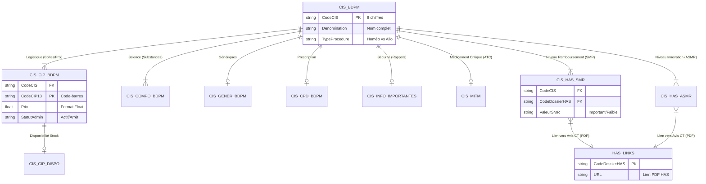

# Documentation Technique : Base de Données Publique des Médicaments (BDPM)

**Version du document :** 2.0.0 (Master)
**Statut :** Source de Vérité (Single Source of Truth)
**Contexte :** Architecture de données pour l'application PharmaScan.

Ce document est la référence absolue pour l'ingestion (ETL), le parsing et l'exploitation relationnelle des données de la BDPM. Il unifie le schéma officiel de l'ANSM/HAS et les réalités du formatage des données brutes.

---

## 1. Architecture & Modélisation

### 1.1. Diagramme Entité-Relation (ERD)

Le modèle s'articule autour du **CIS** (Code Identifiant de Spécialité) pour les données cliniques et logistiques, et pivote vers le **Code Dossier HAS** pour l'évaluation médicale (remboursement/efficacité).

### 1.2. Contraintes Techniques Globales

Tout parser doit impérativement respecter ces règles pour éviter la corruption de données :

*   **Encodage Source :** `ISO-8859-1` (Latin-1) ou `Windows-1252`. **Ne jamais ouvrir en UTF-8 sans conversion.**
*   **Séparateur :** Tabulation (`\t`).
*   **Délimiteurs de texte :** Aucun (pas de guillemets).
*   **Valeurs NULL :** Chaîne vide ou saut de tabulation consécutif.
*   **Format Dates :** `JJ/MM/AAAA` (ex: `18/12/2024`) $\rightarrow$ Convertir en `DATE (YYYY-MM-DD)`.
*   **Format Décimal :** Virgule `,` (ex: `12,50`) $\rightarrow$ Convertir en `FLOAT` (`12.50`).

---

## 2. Cœur du Médicament (Identité & Logistique)

### 2.1. Fichier Spécialités : `CIS_bdpm.txt`
*Table maîtresse. Unicité par médicament (forme + dosage).*

| Index | Colonne | Type | Règles de Parsing / Valeurs | Exemple |
| :--- | :--- | :--- | :--- | :--- |
| 0 | **Code CIS** | PK | Int (8) | `69836364` |
| 1 | Dénomination | Text | Nom complet. | `STAPHYSAGRIA BOIRON...` |
| 2 | Forme Pharma | Text | | `comprimé` |
| 3 | Voies Admin | Text | Séparateur `;`. | `orale;sublinguale` |
| 4 | Statut AMM | Text | Filtrer : Garder uniquement `Autorisation active`. | `Autorisation active` |
| 5 | Type Procédure | Text | **Détection Homéopathie :** Si contient "homéo". | `Enreg homéo (Proc. Nat.)` |
| 6 | État Commercialisation | Text | | `Commercialisée` |
| 7 | Date AMM | Date | JJ/MM/AAAA | `04/11/2015` |
| 8 | Statut BDM | Text | `Warning disponibilité` ou vide. | |
| 9 | Numéro EU | Text | | `EU/1/07/438` |
| 10 | Titulaire | Text | Nettoyer " (PAYS)" pour affichage. | `BOIRON` |
| 11 | **Surveillance Renforcée** | Bool | `Oui` / `Non` $\rightarrow$ Convertir en `TRUE/FALSE`. | `Non` |

### 2.2. Fichier Présentations (Boîtes) : `CIS_CIP_bdpm.txt`
*Le lien physique (Scan Code-barres).*

| Index | Colonne | Type | Règles de Parsing | Exemple |
| :--- | :--- | :--- | :--- | :--- |
| 0 | Code CIS | FK | | `64610112` |
| 1 | Code CIP7 | Text | Obsolète mais présent. | `4163911` |
| 2 | Libellé Présentation | Text | Description du conditionnement. | `plaquette(s)... de 28 comprimé(s)` |
| 3 | Statut Admin | Text | | `Présentation active` |
| 4 | État Commercialisation | Enum | "Déclaration de commercialisation", "Déclaration d'arrêt...", "Arrêt...". | `Déclaration de commercialisation` |
| 5 | Date Déclaration | Date | Date du statut. | `21/12/2011` |
| 6 | **Code CIP13** | PK | **Le code DataMatrix scanné.** | `3400941639111` |
| 7 | Agrément Collectivités | Bool | `oui` / `non`. Indicateur Hospitalier (voir §5.1). | `oui` |
| 8 | Taux Remboursement | Int | Nettoyer `%`. Si multiples (`65%;30%`), prendre le max. | `65%` |
| 9 | **Prix (Euro)** | Float | Remplacer `,` par `.`. Si vide $\rightarrow$ Prix libre/Hôpital. | `12,00` |
| 10 | Prix + Hono | Float | Prix final avec honoraires (indicatif). | `13,02` |
| 11 | Honoraires | Float | Montant honoraires pharmaciens. | `1,02` |
| 12 | Indications Remb. | Text | Texte libre HTML. | `Ce médicament peut être...` |

### 2.3. Fichier Compositions : `CIS_COMPO_bdpm.txt`
*La définition chimique. Attention aux lignes multiples (Sels vs Base).*

| Index | Colonne | Type | Règles de Parsing | Exemple |
| :--- | :--- | :--- | :--- | :--- |
| 0 | Code CIS | FK | | `64944927` |
| 1 | Élément Pharmaceutique | Text | Forme galénique associée. | `crème` |
| 2 | Code Substance | Int | ID unique substance. | `02160` |
| 3 | **Dénomination Substance** | Text | Nom chimique. | `ACIDE FUSIDIQUE` |
| 4 | **Dosage** | Text | **Complexe.** Peut être `2 g`, `1000 mg`, `4CH`. | `2 g` |
| 5 | Référence Dosage | Text | Unité de référence. | `100 g de crème` |
| 6 | **Nature Composant** | Enum | `SA` (Active) ou `FT` (Fraction). Voir règle §5.2. | `SA` |
| 7 | Numéro Liaison | Int | Pour lier SA et FT (ex: Sel et Base). | `1` |

---

## 3. Évaluation Médicale (Haute Autorité de Santé) - *NOUVEAU*

Ces fichiers sont essentiels pour afficher l'efficacité (`SMR`) et l'innovation (`ASMR`) d'un médicament.

### 3.1. Avis SMR : `CIS_HAS_SMR_bdpm.txt`
*Service Médical Rendu : Détermine le taux de remboursement.*

| Index | Colonne | Description | Parsing |
| :--- | :--- | :--- | :--- |
| 0 | Code CIS | Clé étrangère. | |
| 1 | **Code Dossier HAS** | **Clé de jointure** vers `HAS_LiensPageCT`. | ex: `CT-18365` |
| 2 | Motif Évaluation | Raison de l'avis. | `Renouvellement d'inscription` |
| 3 | Date Avis | JJ/MM/AAAA. | `18/12/2019` |
| 4 | **Valeur SMR** | Le niveau brut. | `Important`, `Modéré`, `Faible`, `Insuffisant` |
| 5 | Libellé SMR | Description détaillée. | `Le service médical rendu est important...` |

### 3.2. Avis ASMR : `CIS_HAS_ASMR_bdpm.txt`
*Amélioration du SMR : L'apport thérapeutique par rapport à l'existant.*

| Index | Colonne | Description | Parsing |
| :--- | :--- | :--- | :--- |
| 0 | Code CIS | Clé étrangère. | |
| 1 | Code Dossier HAS | Clé de jointure. | |
| 2 | Motif | | |
| 3 | Date Avis | | |
| 4 | **Valeur ASMR** | Niveau (I à V). | `IV`, `V` (Inexistante), `I` (Majeure) |
| 5 | Libellé ASMR | Description. | `Amélioration mineure`, `Absence d'amélioration` |

### 3.3. Liens PDF HAS : `HAS_LiensPageCT_bdpm.txt`
*Le pont vers le document officiel.*

| Index | Colonne | Description |
| :--- | :--- | :--- |
| 0 | **Code Dossier HAS** | Clé Primaire. |
| 1 | **Lien URL** | URL complète vers le PDF de l'avis. |

---

## 4. Écosystème & Sécurité

### 4.1. Génériques : `CIS_GENER_bdpm.txt`

| Index | Colonne | Règles de Parsing |
| :--- | :--- | :--- |
| 0 | ID Groupe | Identifiant de regroupement. |
| 1 | **Libellé Groupe** | Format : `[Nom Générique] - [Nom Princeps]`. **Action :** Splitter cette chaîne sur `" - "` pour indexer le nom propre de la molécule. |
| 2 | Code CIS | |
| 3 | **Type** | `0`=Princeps, `1`=Générique, `2`=Générique complémentaire, `4`=Substituable. |
| 4 | Tri | Ordre d'affichage. |

### 4.2. Disponibilité (Stock) : `CIS_CIP_Dispo_Spec.txt`

*Données critiques temps réel.*

| Index | Colonne | Règles de Parsing |
| :--- | :--- | :--- |
| 0 | Code CIS | |
| 1 | Code CIP13 | Peut être vide (si tout le CIS est touché). |
| 2 | **Statut** | `1`=Rupture, `2`=Tension, `3`=Arrêt, `4`=Remise à dispo. |
| 3 | Libellé Statut | "Rupture de stock", "Tension d'approvisionnement". |
| 4 | Date Début | JJ/MM/AAAA. |
| 5 | Date Fin | JJ/MM/AAAA (Prévisionnelle). Peut être vide. |
| 6 | **Lien Suivi** | URL vers le site ANSM (détail pénurie). **À afficher.** |

### 4.3. Infos Importantes : `CIS_InfoImportantes...txt`

| Index | Colonne | Règles de Parsing |
| :--- | :--- | :--- |
| 0 | Code CIS | |
| 1 | Date Début | |
| 2 | Date Fin | |
| 3 | Texte/Lien | HTML brut. Contient un lien `href` vers le PDF de sécurité. |

**Règle PharmaScan :** N'afficher l'alerte que si `TODAY() BETWEEN DateDébut AND DateFin`.

---

## 5. Recettes Techniques (ETL & Business Logic)

### 5.1. Détection "Médicament Hospitalier"
Un médicament est considéré comme "réservé hôpital" (non disponible en pharmacie de ville) si :
1.  `Agrément Collectivités` (CIP col 7) == `oui`.
2.  **ET** `Prix` (CIP col 9) est `NULL` ou vide.

*Exemple Data :* Ligne 61111570 (CIP 5870148) -> Prix vide, Agrément non (parfois incohérent, se fier au Prix vide).
*Contre-exemple :* Ligne 64610112 -> Prix `12,00`, Agrément `oui` -> Disponible en ville et hôpital.

### 5.2. Normalisation du Dosage (Algorithme "Sel/Base")
Pour afficher proprement le dosage (ex: "1000 mg" au lieu de "1200 mg de sel") :
1.  Regrouper les lignes de `CIS_COMPO` par `(CIS, Numéro Liaison)`.
2.  Pour chaque groupe :
    *   Si une ligne a `Nature == 'FT'` (Fraction Thérapeutique), **utiliser uniquement cette ligne**. C'est la base active réelle.
    *   Sinon, utiliser la ligne `Nature == 'SA'` (Substance Active).
3.  Concaténer `Dénomination Substance` + `Dosage` + `Référence Dosage`.

### 5.3. Nettoyage des Prix
Le fichier source contient des séparateurs milliers ou des aberrations OCR (rare).
**Algorithme :**
1.  Remplacer `,` par `.`.
2.  Supprimer tout caractère non numérique sauf le point `.`.
3.  Caster en `Float`.
4.  Exemple : `1,226,20` (Format incorrect vu dans raw data) $\rightarrow$ Si longueur > 6 char et 2 virgules, suspicion erreur format. Standard attendu : `1226.20`.

### 5.4. Indexation Recherche (Full Text Search)
Pour une recherche efficace, créer une colonne virtuelle concaténant :
1.  `CIS.Denomination` (Nom commercial)
2.  `COMPO.DenominationSubstance` (Nom molécule)
3.  `GENER.LibelléGroupe` (Nom générique normalisé, partie gauche du tiret)

---

## 6. Liste des Fichiers et URLs Officielles

URL de base : `https://base-donnees-publique.medicaments.gouv.fr/telechargement.php`

| Fichier Local | Fichier Source ANSM | Fréquence MAJ |
| :--- | :--- | :--- |
| `CIS_bdpm.txt` | `CIS_bdpm.txt` | Quotidien |
| `CIS_CIP_bdpm.txt` | `CIS_CIP_bdpm.txt` | Quotidien |
| `CIS_COMPO_bdpm.txt` | `CIS_COMPO_bdpm.txt` | Quotidien |
| `CIS_GENER_bdpm.txt` | `CIS_GENER_bdpm.txt` | Quotidien |
| `CIS_CPD_bdpm.txt` | `CIS_CPD_bdpm.txt` | Quotidien |
| `CIS_HAS_SMR_bdpm.txt` | `CIS_HAS_SMR_bdpm.txt` | Quotidien |
| `CIS_HAS_ASMR_bdpm.txt` | `CIS_HAS_ASMR_bdpm.txt` | Quotidien |
| `HAS_LiensPageCT_bdpm.txt`| `HAS_LiensPageCT_bdpm.txt` | Quotidien |
| `CIS_CIP_Dispo_Spec.txt` | `CIS_CIP_Dispo_Spec.txt` | Temps Réel |
| `CIS_MITM.txt` | `CIS_MITM.txt` | Irrégulier |
| `CIS_InfoImportantes.txt` | `CIS_InfoImportantes_[DATE].txt` | Irrégulier |