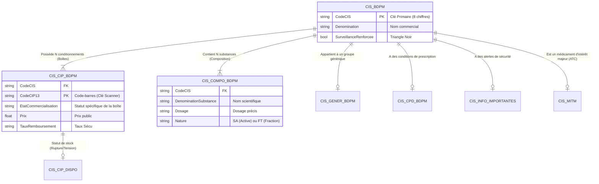

# Documentation Technique : Base de Données Publique des Médicaments (BDPM)

**Version du document :** 1.0.0 (Final)
**Statut :** Source de Vérité (Single Source of Truth)
**Contexte :** Architecture de données pour l'application PharmaScan.

Ce document est la référence absolue pour l'ingestion, le parsing et l'exploitation relationnelle des données de la BDPM. Il remplace toute logique heuristique précédente par une approche déterministe basée sur la structure relationnelle officielle fournie par l'ANSM et la HAS.

---

## 1. Architecture & Spécifications Techniques

### 1.1. Modèle Relationnel

Le modèle de données s'articule autour d'une clé primaire centrale : le code **CIS** (Code Identifiant de Spécialité).



### 1.2. Spécifications d'Ingestion (Parsing)

Pour garantir l'intégrité des données, le parser **DOIT** respecter ces contraintes :

* **Encodage Fichier :** `ISO-8859-1` (Latin-1) ou `Windows-1252`. **Attention :** Les fichiers ne sont PAS en UTF-8. Une lecture en UTF-8 corrompra les accents (ex: `comprimé` deviendra illisible).
* **Séparateur de Champ :** Tabulation (`\t`).
* **Délimiteurs de Texte :** Aucun. Pas de guillemets (`"`) autour des chaînes.
* **Sauts de Ligne :** `CRLF` (`\r\n`) ou `LF` (`\n`) selon le système d'origine.
* **Format des Dates :** `JJ/MM/AAAA` (ex: `18/12/2024`). **Action :** Convertir impérativement en `YYYY-MM-DD` lors de l'insertion en base pour permettre le tri et les comparaisons SQL.
* **Format des Décimaux :** Virgule `,` (ex: `24,34`). **Action :** Remplacer par un point `.` pour le stockage numérique (`float`/`decimal`).

---

## 2. Analyse Détaillée des Fichiers Cœur

### 2.1. Fichier des Spécialités : `CIS_bdpm.txt`

**Rôle :** Table maîtresse définissant l'identité administrative et réglementaire du médicament.

| Index | Colonne | Description & Règles | Exemple de Donnée |
| :--- | :--- | :--- | :--- |
| 0 | **Code CIS** | **Clé Primaire (8 chiffres).** Identifiant unique du médicament. | `65329132` |
| 1 | Dénomination | Nom complet (Marque + Dosage + Forme). | `ABECMA 260 - 500 x 1 000 000 cellules, dispersion pour perfusion` |
| 2 | Forme Pharmaceutique | Forme galénique normalisée. | `dispersion pour perfusion` |
| 3 | Voies d'administration | Séparées par `;`. | `intraveineuse` |
| 4 | Statut AMM | État légal de l'autorisation. | `Autorisation active` |
| 5 | Type Procédure | Cadre réglementaire (exclure "Enreg homéo" pour l'allopathie). | `Procédure centralisée` |
| 6 | État Commercialisation | État global (Attention : voir CIP pour le détail). | `Commercialisée` |
| 7 | Date AMM | Date d'autorisation (JJ/MM/AAAA). | `18/08/2021` |
| 8 | Statut BDM | `Warning disponibilité` ou vide. | (Vide) |
| 9 | Numéro EU | Numéro d'autorisation européenne. | `EU/1/21/1539` |
| 10 | Titulaire | Laboratoire responsable. Séparés par `;`. | `BRISTOL-MYERS SQUIBB PHARMA (IRLANDE)` |
| 11 | **Surveillance Renforcée** | **CRITIQUE.** Indicateur de pharmacovigilance (Triangle Noir). Valeurs : `Oui` / `Non`. | `Oui` |

#### Stratégie d'Exploitation PharmaScan (2025)

1. **Alerte de Sécurité :** Si `Col 11 == 'Oui'`, afficher un badge rouge **"⚠️ Surveillance Renforcée"** sur la fiche produit.
2. **Filtrage des Données :** Exclure ou marquer spécifiquement les lignes où `Col 5` contient "homéo" ou "phyto" si l'application se concentre sur les médicaments conventionnels.
3. **AMM Strictement Active :** **Ignorer toute entrée dont `Col 4 (Statut AMM)` est différent de `Autorisation active`.** Ces CIS ne sont plus commercialisables et polluent les recherches.
4. **Nettoyage du Nom :** Pour l'affichage, utiliser un algorithme de soustraction : `Nom Nettoyé` = `Col 1` (Dénomination) - `Col 2` (Forme) - `Col 10` (Titulaire).

---

### 2.2. Fichier des Présentations (Boîtes) : `CIS_CIP_bdpm.txt`

**Rôle :** Lien entre le monde logistique (Code-barres, Prix) et le médicament. C'est le point d'entrée du Scanner.

| Index | Colonne | Description & Règles | Exemple de Donnée |
| :--- | :--- | :--- | :--- |
| 0 | Code CIS | Clé étrangère vers `CIS_bdpm.txt`. | `60002283` |
| 1 | Code CIP7 | Ancien code 7 chiffres. | `4949770` |
| 2 | Libellé Présentation | Description du conditionnement physique. | `plaquette(s) PVC PVDC aluminium de 90 comprimé(s)` |
| 3 | Statut Admin | Statut administratif de la présentation. | `Présentation active` |
| 4 | **État Commercialisation** | **CRITIQUE.** Statut réel de la boîte. Valeurs : `Déclaration de commercialisation`, `Déclaration d'arrêt`, `Arrêt de commercialisation`. | `Déclaration de commercialisation` |
| 5 | Date Déclaration | Date du statut (JJ/MM/AAAA). | `19/09/2011` |
| 6 | **Code CIP13** | **Clé Scanner (DataMatrix).** 13 chiffres. | `3400949497706` |
| 7 | Agrément Collectivités | Utilisable à l'hôpital ? `oui` / `non`. | `oui` |
| 8 | Taux Remboursement | Pourcentage Sécu. Peut contenir multiples valeurs (`65%;30%`). | `100%` |
| 9 | Prix (Euro) | Prix public TTC. Format `X,XX`. | `24,34` |
| 10 | Prix (Euro) | (Redondant ou format alternatif). | `25,36` |
| 11 | Honoraires | Montant honoraire dispensation inclus. | `2,76` |
| 12 | Indications Remb. | Texte libre sur les conditions de remboursement. | (Texte long ou vide) |

#### Stratégie d'Exploitation PharmaScan (2025)

1. **Gestion des "Boîtes Mortes" :** Lorsqu'un utilisateur scanne un CIP13 :
    * Vérifier `Col 4` (État Commercialisation).
    * Si "Arrêt" ou "Déclaration d'arrêt", afficher **"⚠️ Ce format n'est plus commercialisé"**, même si le médicament (CIS) est toujours actif.
2. **Détection "Hospitalier" :**
    * Si `Col 7 (Agrément)` == "oui" **ET** `Col 9 (Prix)` est vide/null/0.
    * ALORS afficher le badge **"🏥 Réservé Hôpital / Collectivités"**.
3. **Affichage Prix :** Afficher directement la `Col 9` + `€`. Si vide, afficher "Prix libre ou inconnu".

---

### 2.3. Fichier des Compositions : `CIS_COMPO_bdpm.txt`

**Rôle :** La vérité scientifique et chimique. C'est la seule source fiable pour les dosages.

| Index | Colonne | Description & Règles | Exemple 1 (Base) | Exemple 2 (Sel) |
| :--- | :--- | :--- | :--- | :--- |
| 0 | Code CIS | Clé étrangère. | `60002283` | `60004932` |
| 1 | Élément Pharmaceutique | Forme (ex: comprimé, sirop). | `comprimé` | `comprimé` |
| 2 | Code Substance | ID unique de la substance. | `42215` | `24321` |
| 3 | **Dénomination Substance** | Nom chimique standardisé. | `ANASTROZOLE` | `CHLORHYDRATE DE METFORMINE` |
| 4 | **Dosage Substance** | Valeur numérique + unité. | `1,00 mg` | `1000 mg` |
| 5 | Référence Dosage | Unité de prise. | `un comprimé` | `un comprimé` |
| 6 | **Nature Composant** | **CRITIQUE.** `SA`=Substance Active, `ST`=Fraction Thérapeutique. | `SA` | `SA` |
| 7 | Numéro Liaison | Lien SA <-> ST (pour gérer sels/bases). | `1` | `1` |

**Exemple de relation Sel/Base (Metformine 60004932) :**
Ligne 1 : `CHLORHYDRATE DE METFORMINE` | `1000 mg` | `SA` (C'est le sel chimique présent)
Ligne 2 : `METFORMINE` | `780 mg` | `FT` (C'est la base active correspondante)

#### Stratégie d'Exploitation PharmaScan (2025)

1. **Dosage Structuré (Fin du Regex) :** Pour afficher le dosage, interroger cette table.
    * Regrouper les lignes par `(CIS, Numéro de Liaison)`.
    * **Si une Fraction Thérapeutique (`Nature == 'FT'`) existe pour ce lien, ignorer toutes les `SA` associées et conserver uniquement la ligne FT (plus propre, sans sel).**
    * Si aucune FT n'existe, conserver les `SA` telles quelles.
    * Concaténer `Dénomination` + `Dosage` pour obtenir une liste propre (ex: "Paracétamol 500 mg + Codéine 30 mg").
    * **Standardisation :** Nettoyer les valeurs numériques (ex: `1,00 mg` -> `1 mg`) via la librairie `Decimal`.
2. **Moteur de Recherche Moléculaire :**
    * Indexer la `Col 3` (Dénomination Substance) dans le moteur FTS5.
    * Permet de trouver "Doliprane" en tapant "Paracetamol" sans dictionnaire de synonymes manuel.

---

### 2.4. Fichier des Groupes Génériques : `CIS_GENER_bdpm.txt`

**Rôle :** Définit l'interchangeabilité légale entre médicaments.

| Index | Colonne | Description & Règles | Exemple de Donnée |
| :--- | :--- | :--- | :--- |
| 0 | **ID Groupe** | Identifiant unique du groupe générique. | `33` |
| 1 | Libellé Groupe | Nom du groupe (Molécule + Dosage). | `METFORMINE (CHLORHYDRATE DE) 1000 mg - GLUCOPHAGE 1000 mg...` |
| 2 | Code CIS | Clé étrangère. | `61052830` |
| 3 | **Type** | Rôle du médicament dans le groupe. | `0` = Princeps<br>`1` = Générique<br>`2` = Générique par complémentarité<br>`4` = Générique substituable |
| 4 | Tri | Ordre d'affichage. | `1` |

#### Stratégie d'Exploitation PharmaScan (2025)

1. **Navigation Group-First :** Dans l'interface de recherche, regrouper les résultats par `ID Groupe`.
2. **Identification Immédiate :**
    * Si `Type == 0` -> Afficher le badge **"PRINCEPS"**.
    * Si `Type IN (1, 2, 4)` -> Afficher le badge **"GÉNÉRIQUE"**.
3. **Nettoyage du Libellé :** Le libellé du groupe est souvent verbeux. Il peut être parsé (tout ce qui est avant le " - ") pour obtenir un nom de groupe propre (ex: "METFORMINE 1000 mg").

---

## 3. Fichiers d'Enrichissement (Contexte & Sécurité)

### 3.1. Classification ATC & MITM : `CIS_MITM.txt`

**Rôle :** Apporte la classification anatomique (ATC) et identifie les médicaments critiques.

| Index | Colonne | Description | Exemple |
| :--- | :--- | :--- | :--- |
| 0 | Code CIS | Clé étrangère. | `68053454` |
| 1 | **Code ATC** | Code Anatomique Thérapeutique Chimique. | `A02BA01` |
| 2 | Dénomination | Nom (redondant). | `CIMETIDINE ARROW...` |
| 3 | Lien BDPM | URL vers la fiche publique. | `https://...` |

#### Stratégie d'Exploitation

1. **Navigation par Catégorie :** Utiliser le Code ATC pour classer les médicaments.
    * `A` = Système digestif
    * `C` = Système cardio-vasculaire
    * etc.
2. **Badge MITM :** Si un CIS est présent dans ce fichier, afficher un badge **"Intérêt Thérapeutique Majeur"** (Indique qu'une rupture de stock est critique).

### 3.2. Conditions de Prescription : `CIS_CPD_bdpm.txt`

**Rôle :** Contraintes légales de délivrance.

| Index | Colonne | Description | Exemple |
| :--- | :--- | :--- | :--- |
| 0 | Code CIS | Clé étrangère. | `60002283` |
| 1 | Condition | Texte de la condition. | `Liste I`, `Stupéfiant`, `Prescription réservée aux spécialistes` |

#### Stratégie d'Exploitation

* Afficher ces conditions sous forme de "Tags" ou "Badges" dans la fiche détaillée (ex: Badge Rouge pour "Liste I" ou "Stupéfiant").

### 3.3. Disponibilité (Temps Réel) : `CIS_CIP_Dispo_Spec.txt`

**Rôle :** Alertes de stock.

| Index | Colonne | Description |
| :--- | :--- | :--- |
| 0 | Code CIS | Clé étrangère. |
| 1 | Code CIP13 | Code-barres concerné (parfois vide si tout le CIS est touché). |
| 2 | **Code Statut** | `1`=Rupture, `2`=Tension, `3`=Arrêt, `4`=Remise à dispo. |
| 3 | Libellé Statut | Texte associé. |
| 4 | Date Début | Date de début de l'incident. |

#### Stratégie d'Exploitation

* **Alerte Critique :** Si un CIP scanné ou un CIS recherché est présent ici avec Statut 1 ou 2, afficher une **bannière d'alerte rouge** en haut de l'écran : "⚠️ En rupture de stock depuis le [Date]".

### 3.4. Informations de Sécurité : `CIS_InfoImportantes...txt`

**Rôle :** Communications de l'ANSM (Rappels de lots, nouvelles contre-indications).

| Index | Colonne | Description |
| :--- | :--- | :--- |
| 0 | Code CIS | Clé étrangère. |
| 1 | Date Début | Début validité info. |
| 2 | Date Fin | Fin validité info. |
| 3 | Texte/Lien | Message HTML + Lien PDF. |

#### Stratégie d'Exploitation

* Vérifier si `Date du jour` est entre `Date Début` et `Date Fin`.
* Si oui, afficher un bouton ou une bannière **"Information de Sécurité en Cours"** avec un lien cliquable vers le PDF de l'ANSM.

---

## 4. Recettes Logiques (Business Logic)

### Recette 1 : Algorithme de Détermination du Statut "Hospitalier"

Pour savoir si un médicament est réservé à l'usage hospitalier :

```dart
bool isHospitalOnly(Presentation row) {
  // Si agréé aux collectivités (Col 7 = 'oui')
  // ET que le prix (Col 9) est vide ou nul
  // Alors c'est un médicament acheté par l'hôpital, non vendu en officine
  return row.agrementCollectivites == 'oui' && (row.prix == null || row.prix == '');
}
```

### Recette 2 : Construction de la Fiche Produit "Parfaite"

Pour afficher une fiche produit complète :

1. **Header :** `CIS.Dénomination` (Nettoyé) + Badges (Princeps/Générique, Surveillance, MITM).
2. **Sous-titre :** `COMPO` -> Liste des substances actives + dosages normalisés.
3. **Détail Conditionnement (Scan) :** `CIP.Libellé` + `CIP.Prix` + `CIP.TauxRemb` + Badge Statut (`CIP.EtatCommercialisation`).
4. **Contexte Médical :** `CPD.Condition` (Liste I/II) + Catégorie ATC (`MITM.CodeATC`).
5. **Alertes :** `DISPO` (Stock) + `INFO` (Sécurité).

### Recette 3 : Indexation Moteur de Recherche (FTS5)

Pour une recherche performante et tolérante :

Créer une table virtuelle FTS5 `search_index` avec une colonne concaténée :
`search_text = CIS.Denomination + ' ' + GROUP_CONCAT(COMPO.DenominationSubstance)`

* L'utilisateur tape "Amoxicilline" -> Trouve "CLAMOXYL" (via COMPO).
* L'utilisateur tape "Doliprane" -> Trouve "DOLIPRANE" (via CIS).
